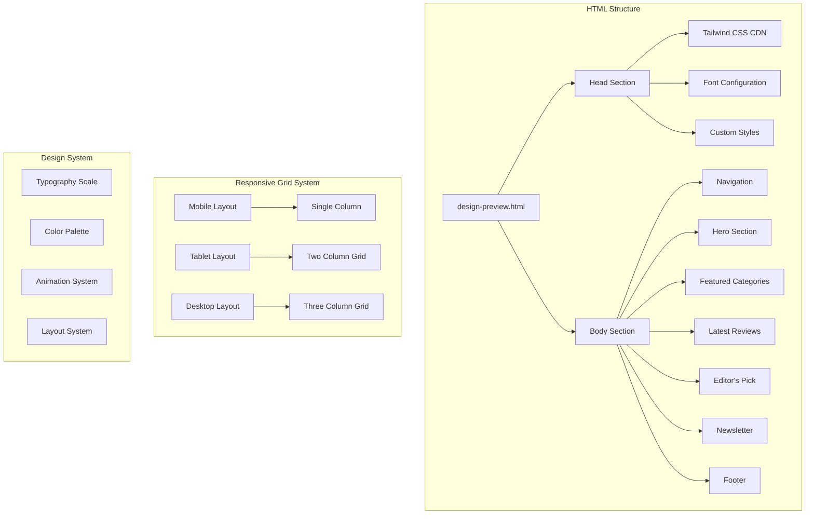
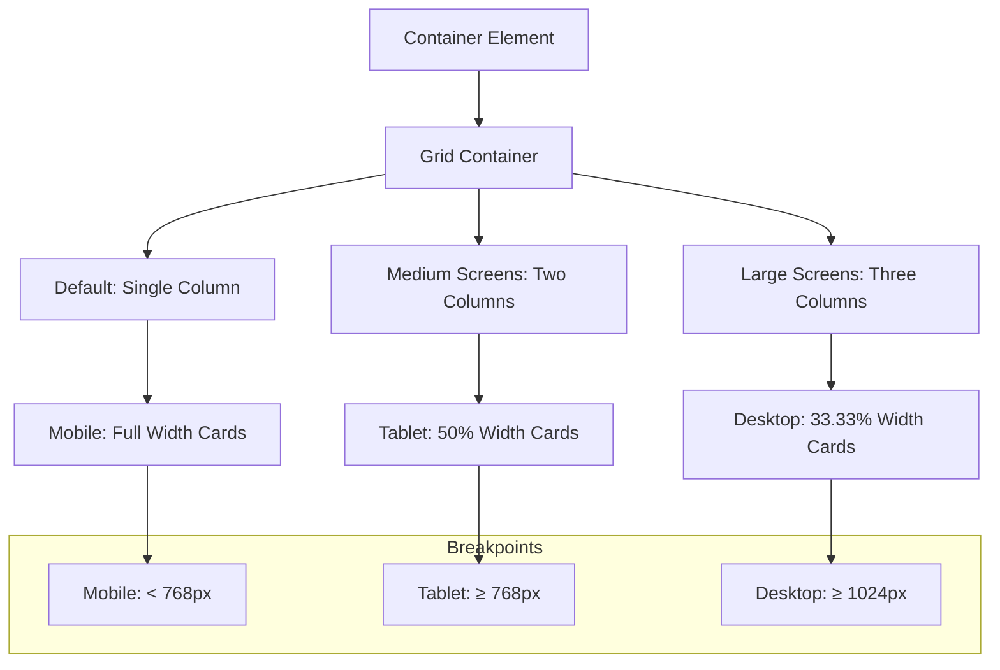
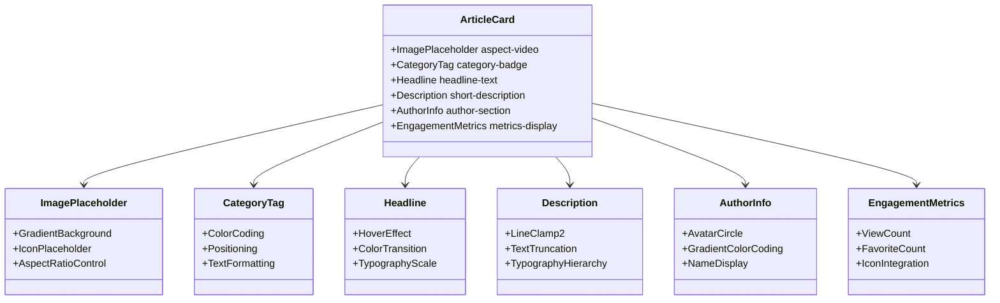
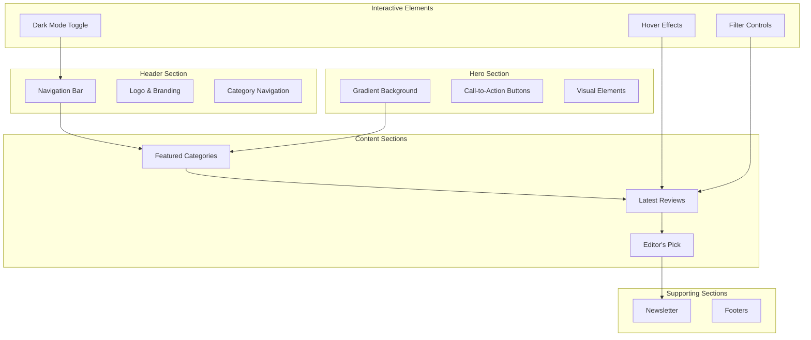
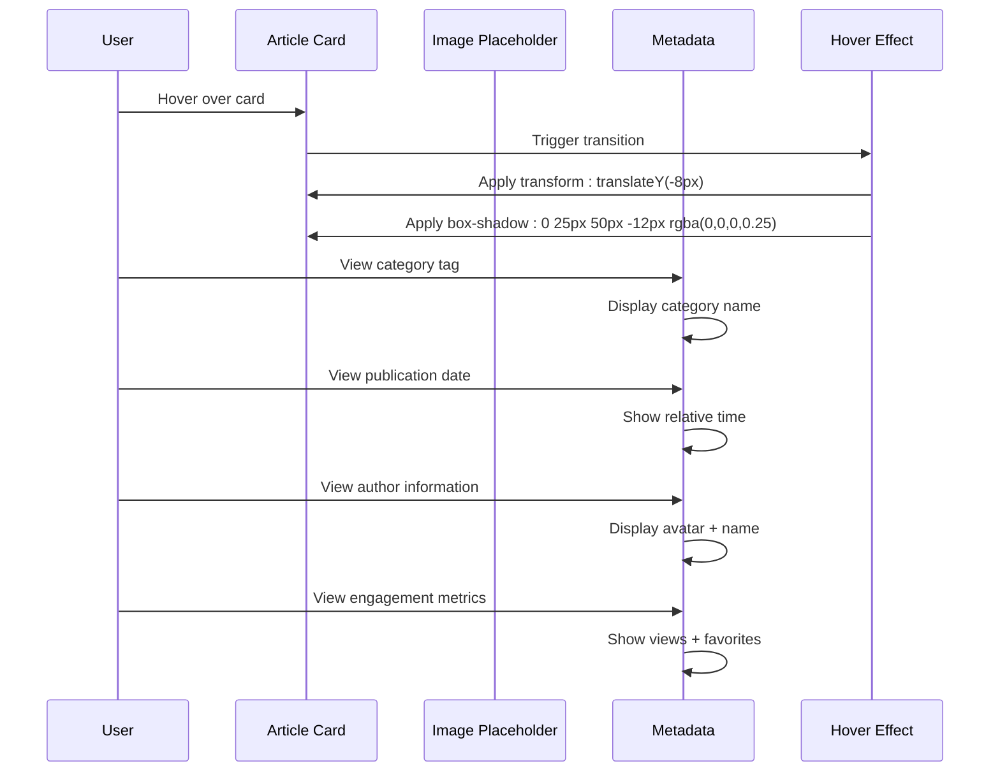
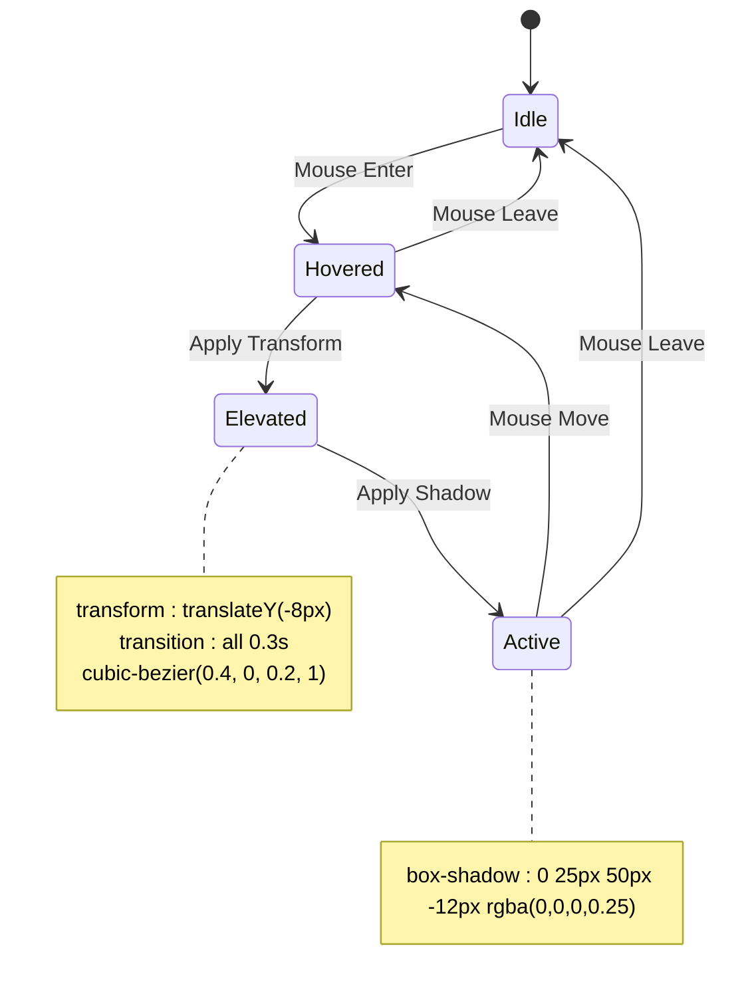
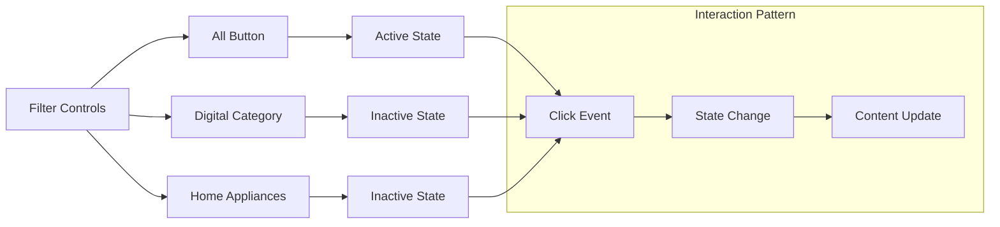
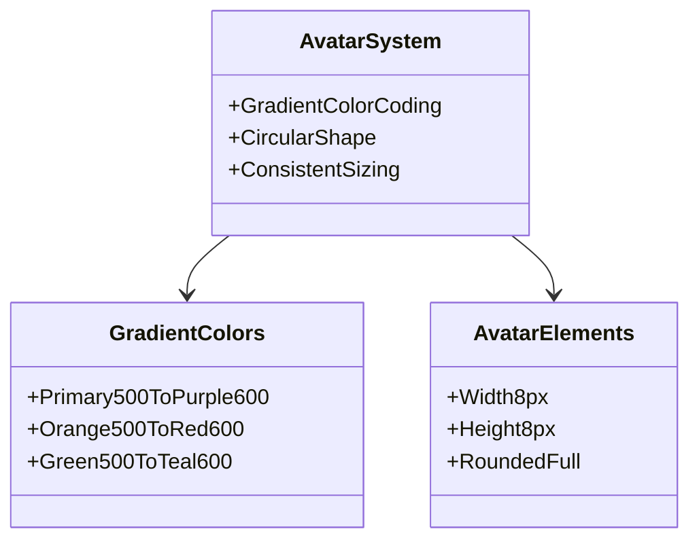
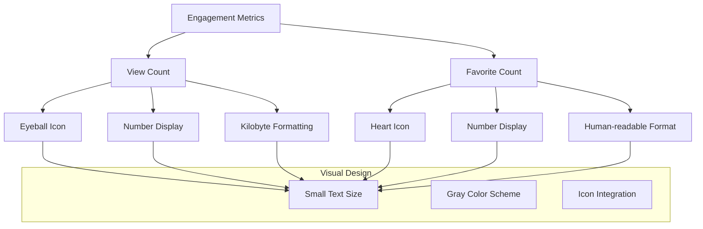
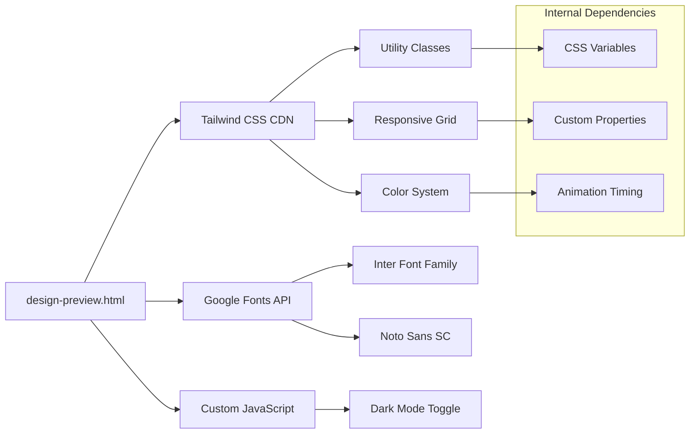

# Content Display System

<cite>
**Referenced Files in This Document**
- [design-preview.html](file://design-preview.html)
</cite>

## Table of Contents
1. [Introduction](#introduction)
2. [Project Structure](#project-structure)
3. [Core Components](#core-components)
4. [Architecture Overview](#architecture-overview)
5. [Detailed Component Analysis](#detailed-component-analysis)
6. [Dependency Analysis](#dependency-analysis)
7. [Performance Considerations](#performance-considerations)
8. [Troubleshooting Guide](#troubleshooting-guide)
9. [Conclusion](#conclusion)

## Introduction

The Content Display System is a comprehensive web interface designed for showcasing product reviews and articles in a visually appealing, responsive layout. Built with modern web technologies including Tailwind CSS, Inter and Noto Sans SC fonts, and dark mode support, this system focuses on delivering an optimal reading experience across all device sizes while maintaining visual hierarchy and information density.

The system centers around three primary content areas: featured categories, latest reviews with interactive article cards, and editorial picks. It employs sophisticated design patterns including gradient backgrounds, glass morphism effects, and subtle animations to create a premium feel while ensuring accessibility and performance.

## Project Structure

The content display system is implemented as a single HTML file that serves as a complete frontend demonstration. The structure follows a mobile-first responsive design approach with progressive enhancement for larger screens.

**Diagram sources**
- [design-preview.html:1-456](file://design-preview.html#L1-L456)

**Section sources**
- [design-preview.html:1-456](file://design-preview.html#L1-L456)

## Core Components

### Three-Column Grid Layout System

The content display system implements a sophisticated responsive grid layout that adapts seamlessly from mobile to desktop:

**Diagram sources**
- [design-preview.html:184](file://design-preview.html#L184)

The grid system utilizes Tailwind CSS's responsive utility classes to achieve automatic column adjustment based on screen size. The `md:grid-cols-2` and `lg:grid-cols-3` classes provide seamless transitions between layouts without requiring custom JavaScript.

### Article Card Architecture

Each article card follows a consistent structure designed for optimal readability and engagement:

**Diagram sources**
- [design-preview.html:186-324](file://design-preview.html#L186-L324)

**Section sources**
- [design-preview.html:184-324](file://design-preview.html#L184-L324)

## Architecture Overview

The content display system follows a modular architecture pattern with distinct sections that can be independently maintained and enhanced:

**Diagram sources**
- [design-preview.html:61-383](file://design-preview.html#L61-L383)

The architecture emphasizes separation of concerns with each section serving a specific purpose in the user journey while maintaining visual consistency through shared design tokens and responsive patterns.

## Detailed Component Analysis

### Latest Reviews Section

The Latest Reviews section showcases the core content display functionality with three article cards demonstrating the complete system:

**Diagram sources**
- [design-preview.html:186-324](file://design-preview.html#L186-L324)

#### Card Structure Implementation

Each article card consists of four primary components:

1. **Image Placeholder**: Gradient background with centered icon representing missing images
2. **Metadata Bar**: Category tag, publication date separator, and date display
3. **Content Area**: Headline with hover effect, description with line clamping, and author information
4. **Engagement Section**: View count and favorite count with appropriate icons

**Section sources**
- [design-preview.html:186-324](file://design-preview.html#L186-L324)

### Interactive Hover Effects System

The hover effect system provides subtle yet engaging animations that enhance user interaction without being distracting:

**Diagram sources**
- [design-preview.html:41-47](file://design-preview.html#L41-L47)

The hover effects utilize CSS transitions with custom cubic-bezier timing functions to create smooth, natural animations that respond to user interaction.

### Content Filtering Controls

The filtering system provides category-based navigation for content discovery:

**Diagram sources**
- [design-preview.html:177-182](file://design-preview.html#L177-L182)

**Section sources**
- [design-preview.html:177-182](file://design-preview.html#L177-L182)

### Author Avatar System

The author avatar system implements gradient color coding for visual distinction and brand consistency:

**Diagram sources**
- [design-preview.html:211](file://design-preview.html#L211)
- [design-preview.html:256](file://design-preview.html#L256)
- [design-preview.html:304](file://design-preview.html#L304)

**Section sources**
- [design-preview.html:211-304](file://design-preview.html#L211-L304)

### Engagement Metrics System

The engagement metrics system displays two key pieces of quantitative information:

**Diagram sources**
- [design-preview.html:214-228](file://design-preview.html#L214-L228)
- [design-preview.html:259-273](file://design-preview.html#L259-L273)
- [design-preview.html:307-321](file://design-preview.html#L307-L321)

**Section sources**
- [design-preview.html:214-321](file://design-preview.html#L214-L321)

## Dependency Analysis

The content display system relies on several external dependencies and internal design systems:

**Diagram sources**
- [design-preview.html:7](file://design-preview.html#L7)
- [design-preview.html:8](file://design-preview.html#L8)
- [design-preview.html:10-29](file://design-preview.html#L10-L29)

The system maintains loose coupling between components while leveraging shared design tokens for consistency. The responsive grid system demonstrates excellent scalability with minimal code overhead.

**Section sources**
- [design-preview.html:7-29](file://design-preview.html#L7-L29)

## Performance Considerations

The content display system implements several performance optimization strategies:

### Responsive Image Handling
- Aspect ratio preservation using `aspect-video` utility
- Gradient placeholders prevent layout shift during image loading
- SVG icons ensure crisp rendering across all resolutions

### Animation Performance
- Hardware-accelerated transforms using `transform` property
- Optimized cubic-bezier timing functions
- Minimal repaint regions for hover effects

### Typography Optimization
- Variable font weights reduce font loading overhead
- Efficient line clamp implementation prevents layout thrashing
- Consistent typography scale reduces rendering complexity

### Dark Mode Efficiency
- CSS class-based switching minimizes JavaScript overhead
- Pre-computed color schemes reduce runtime calculations
- Efficient media query handling for system preference detection

## Troubleshooting Guide

### Common Issues and Solutions

**Grid Layout Problems**
- Verify responsive breakpoint classes are correctly applied
- Ensure container widths accommodate the grid system
- Check for conflicting CSS that might override grid behavior

**Hover Effect Issues**
- Confirm transition duration and timing functions are properly defined
- Verify transform-origin and perspective properties aren't conflicting
- Check for parent element overflow restrictions

**Dark Mode Problems**
- Ensure dark mode class is properly toggled on the root element
- Verify color scheme fallbacks are correctly configured
- Check for specificity conflicts with existing styles

**Typography Truncation**
- Adjust line clamp values based on content length
- Verify font-size and line-height combinations
- Test with various content lengths and screen sizes

**Section sources**
- [design-preview.html:450-456](file://design-preview.html#L450-L456)

## Conclusion

The Content Display System successfully balances visual appeal with functional effectiveness through its comprehensive implementation of modern web design principles. The three-column grid layout provides optimal information density on desktop while maintaining readability on mobile devices. The interactive hover effects enhance user engagement without compromising performance, and the dark mode implementation ensures accessibility across different viewing conditions.

The system's modular architecture allows for easy maintenance and extension, while the consistent design language creates a cohesive user experience. The combination of gradient backgrounds, glass morphism effects, and subtle animations establishes a premium aesthetic that aligns with the brand identity while maintaining technical excellence.

Future enhancements could include lazy loading for images, enhanced accessibility features, and dynamic content loading capabilities to further improve the user experience and system performance.