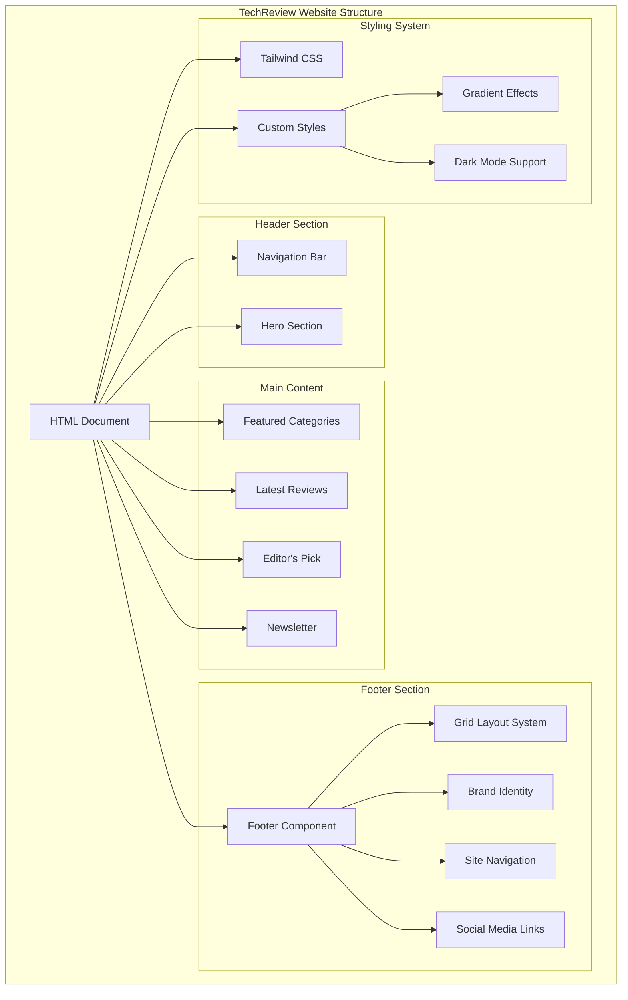
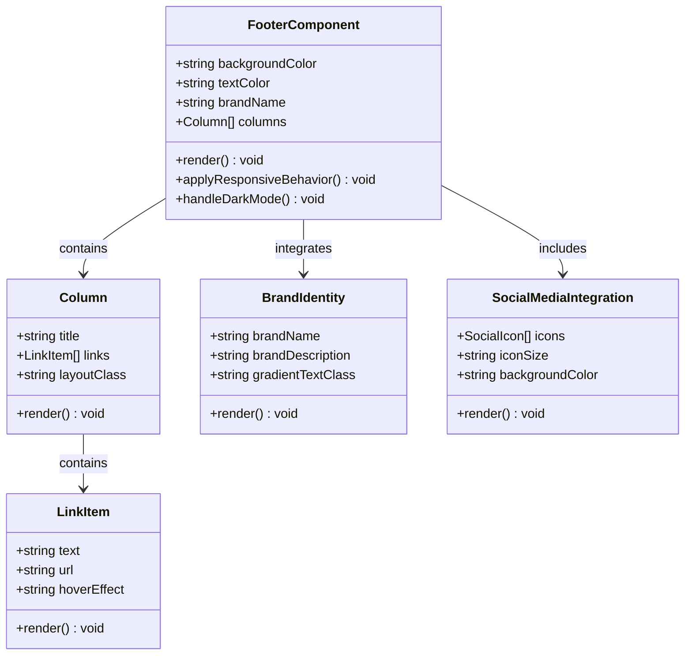
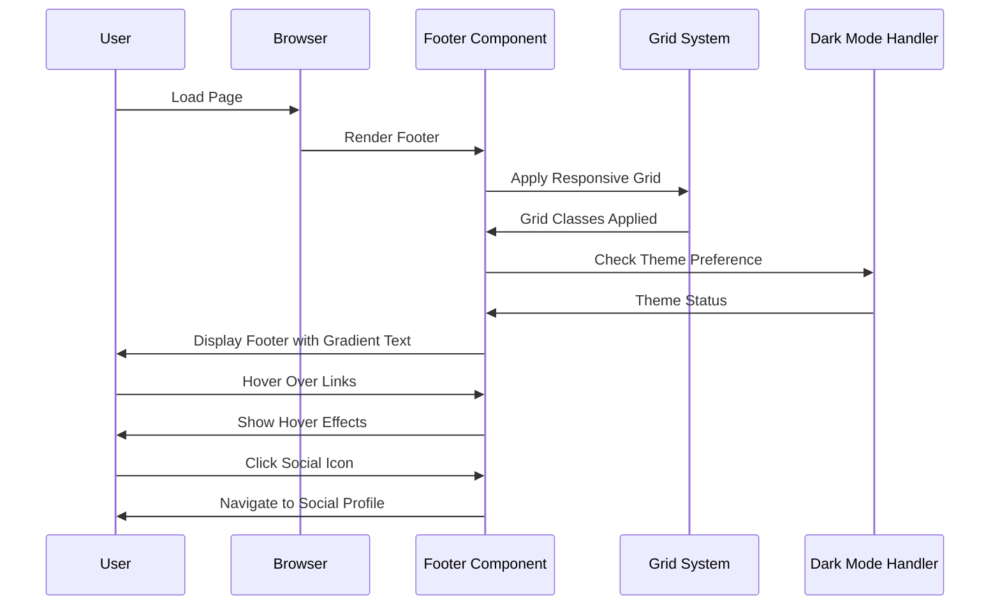
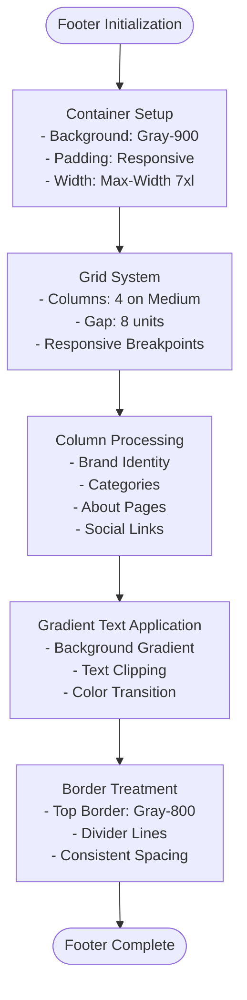
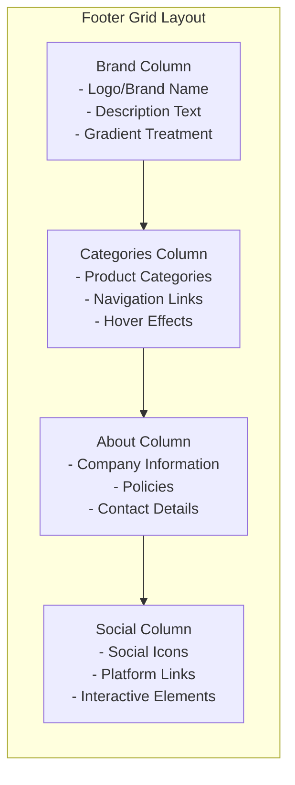
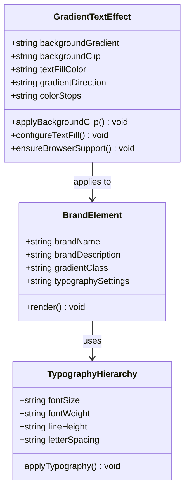
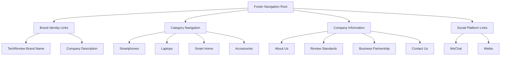
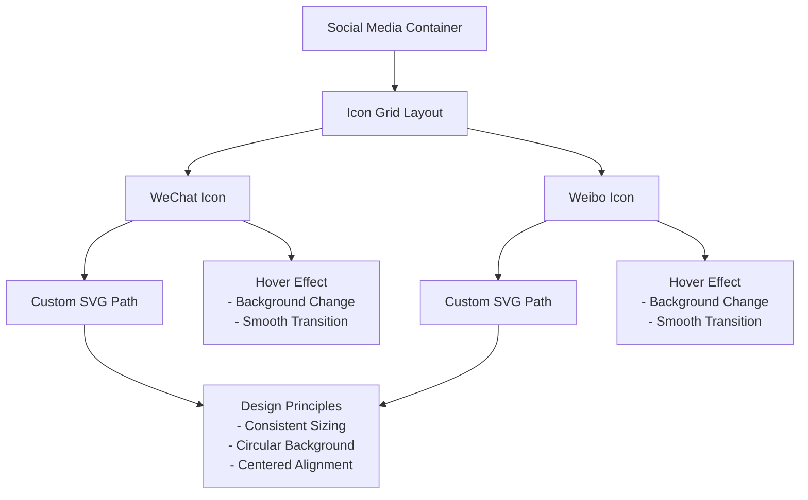
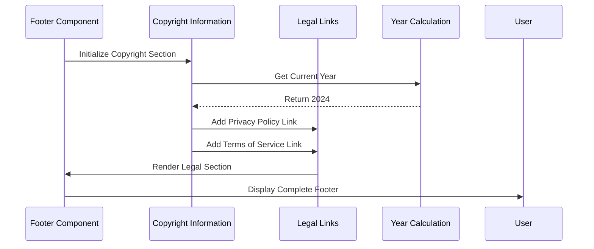
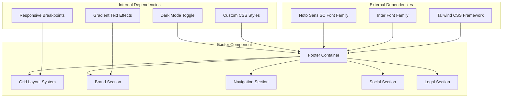

# Footer & Site Structure

<cite>
**Referenced Files in This Document**
- [design-preview.html](file://design-preview.html)
</cite>

## Table of Contents
1. [Introduction](#introduction)
2. [Project Structure](#project-structure)
3. [Core Components](#core-components)
4. [Architecture Overview](#architecture-overview)
5. [Detailed Component Analysis](#detailed-component-analysis)
6. [Dependency Analysis](#dependency-analysis)
7. [Performance Considerations](#performance-considerations)
8. [Troubleshooting Guide](#troubleshooting-guide)
9. [Conclusion](#conclusion)

## Introduction

This document provides comprehensive documentation for the footer component and overall site structure of the TechReview website. The footer implements a sophisticated dark gray background treatment with gradient text branding, featuring a multi-column layout that organizes site information, categories, about pages, and social media links. The design utilizes a grid-based column system with responsive breakpoint behavior, creating an optimal user experience across mobile and desktop devices.

The footer serves as a crucial navigation hub that reinforces brand identity while providing essential navigation and contact information. It demonstrates modern web design principles through its gradient text effects, glass-like elements, and thoughtful spacing arrangements. The implementation showcases how contemporary websites balance aesthetic appeal with functional usability.

## Project Structure

The TechReview website follows a modern, component-based structure built with Tailwind CSS utility classes and custom styling. The project consists of a single HTML file that contains the complete site structure, demonstrating a monolithic approach suitable for static content delivery.

**Diagram sources**
- [design-preview.html:400-448](file://design-preview.html#L400-L448)

The site structure demonstrates a clear hierarchical organization where the footer sits as the final major component, serving as both a content endpoint and navigation hub. The design follows modern web standards with semantic HTML structure and progressive enhancement techniques.

**Section sources**
- [design-preview.html:1-456](file://design-preview.html#L1-L456)

## Core Components

The footer component represents the culmination of the site's design philosophy, integrating multiple design elements into a cohesive navigation and branding system. The component employs several key architectural patterns that contribute to its effectiveness and maintainability.

### Footer Architecture Pattern

The footer implements a modular grid-based architecture that adapts seamlessly across different screen sizes. This pattern ensures consistent user experience while optimizing content presentation for various device types.

**Diagram sources**
- [design-preview.html:400-448](file://design-preview.html#L400-L448)

The footer architecture demonstrates separation of concerns through distinct component responsibilities. Each column maintains its own link hierarchy while contributing to the overall footer structure. This modular approach facilitates maintenance and future enhancements.

**Section sources**
- [design-preview.html:400-448](file://design-preview.html#L400-L448)

## Architecture Overview

The footer component architecture reflects modern web development practices through its use of utility-first CSS frameworks, custom styling solutions, and responsive design principles. The implementation balances aesthetic appeal with functional requirements, creating a professional digital presence.

**Diagram sources**
- [design-preview.html:400-448](file://design-preview.html#L400-L448)
- [design-preview.html:450-456](file://design-preview.html#L450-L456)

The architectural flow demonstrates the component's lifecycle from initial rendering through user interaction. The responsive grid system automatically adapts to different viewport sizes, while the dark mode handler ensures consistent theming across user preferences.

## Detailed Component Analysis

### Footer Container and Background Treatment

The footer container establishes a sophisticated dark gray foundation using Tailwind's gray-900 color palette. This creates a high-contrast backdrop that makes the gradient text branding stand out effectively. The design choice prioritizes readability and visual hierarchy, ensuring that the brand identity remains prominent against the dark background.

**Diagram sources**
- [design-preview.html:400-448](file://design-preview.html#L400-L448)

The background treatment employs a strategic color choice that enhances the gradient text effect while maintaining accessibility standards. The dark theme creates depth and sophistication, positioning the brand name as the focal point of the footer.

**Section sources**
- [design-preview.html:400-448](file://design-preview.html#L400-L448)

### Multi-Column Layout System

The footer implements a four-column grid layout that optimizes content organization and improves navigation efficiency. Each column serves a specific purpose within the site's information architecture, creating logical groupings that align with user expectations.

**Diagram sources**
- [design-preview.html:403-439](file://design-preview.html#L403-L439)

The column system demonstrates thoughtful content partitioning that reflects the site's organizational structure. Each column maintains consistent typography and spacing, creating visual harmony while serving distinct informational roles.

**Section sources**
- [design-preview.html:403-439](file://design-preview.html#L403-L439)

### Brand Identity and Gradient Text Implementation

The brand identity component represents the cornerstone of the footer's visual design, utilizing advanced CSS techniques to create a sophisticated gradient text effect. This implementation requires careful consideration of browser compatibility and performance optimization.

**Diagram sources**
- [design-preview.html:31-37](file://design-preview.html#L31-L37)
- [design-preview.html:404-408](file://design-preview.html#L404-L408)

The gradient text implementation utilizes modern CSS properties including background-clip and text-fill-color, creating a seamless blend between brand identity and visual design. This technique requires vendor prefixes for broader browser support and careful fallback strategies.

**Section sources**
- [design-preview.html:31-37](file://design-preview.html#L31-L37)
- [design-preview.html:404-408](file://design-preview.html#L404-L408)

### Link Hierarchy and Navigation Organization

The footer's navigation system organizes content through a structured hierarchy that guides users efficiently through the site's offerings. Each column contains carefully curated links that serve specific informational purposes.

**Diagram sources**
- [design-preview.html:410-439](file://design-preview.html#L410-L439)

The link hierarchy demonstrates logical categorization that aligns with user mental models of product discovery and company information seeking. Each link maintains consistent styling and hover effects, ensuring predictable user interactions.

**Section sources**
- [design-preview.html:410-439](file://design-preview.html#L410-L439)

### Social Media Integration and Custom SVG Icons

The social media integration component showcases custom SVG icon implementation that enhances brand visibility across multiple platforms. The design emphasizes consistency and visual appeal through standardized sizing and interactive elements.

**Diagram sources**
- [design-preview.html:428-439](file://design-preview.html#L428-L439)

The social media integration demonstrates attention to detail through custom SVG implementations that provide crisp rendering across different resolutions. The interactive elements enhance user engagement while maintaining visual consistency.

**Section sources**
- [design-preview.html:428-439](file://design-preview.html#L428-L439)

### Copyright Information and Legal Links Structure

The footer's legal and copyright information section establishes transparency and compliance while maintaining visual balance. The implementation follows standard web practices for legal disclosure and privacy protection.

**Diagram sources**
- [design-preview.html:440-447](file://design-preview.html#L440-L447)

The legal structure provides essential information for users while maintaining a clean, unobtrusive presentation. The year calculation ensures automatic updates without manual intervention, reducing maintenance overhead.

**Section sources**
- [design-preview.html:440-447](file://design-preview.html#L440-L447)

## Dependency Analysis

The footer component exhibits minimal external dependencies while leveraging modern web technologies effectively. The implementation demonstrates good architectural practices through clear separation of concerns and maintainable code organization.

**Diagram sources**
- [design-preview.html:7-30](file://design-preview.html#L7-L30)
- [design-preview.html:400-448](file://design-preview.html#L400-L448)

The dependency structure reveals a clean architecture where the footer component depends primarily on Tailwind CSS utilities and custom styles. This approach minimizes complexity while maximizing maintainability and performance.

**Section sources**
- [design-preview.html:7-30](file://design-preview.html#L7-L30)
- [design-preview.html:400-448](file://design-preview.html#L400-L448)

## Performance Considerations

The footer implementation incorporates several performance optimization strategies that contribute to overall page load speed and user experience quality. These optimizations demonstrate awareness of modern web performance best practices.

### CSS Optimization Strategies

The gradient text effect implementation utilizes efficient CSS properties that minimize computational overhead while delivering visually appealing results. The design avoids heavy JavaScript dependencies for visual effects, relying instead on pure CSS solutions.

### Responsive Performance

The grid-based layout system employs CSS Grid and Flexbox properties that are highly optimized in modern browsers. The responsive breakpoint system uses media queries that trigger efficiently without causing layout thrashing or excessive reflows.

### Accessibility Performance

The footer maintains excellent accessibility performance through semantic HTML structure and proper contrast ratios. The dark theme implementation ensures sufficient color contrast for text elements while maintaining visual appeal.

## Troubleshooting Guide

Common issues and solutions for the footer component implementation:

### Gradient Text Rendering Issues

**Problem**: Gradient text not displaying correctly in older browsers
**Solution**: Ensure vendor prefixes are included for background-clip and text-fill-color properties. Test across target browser versions and provide appropriate fallback styles.

### Responsive Layout Problems

**Problem**: Footer columns overlapping or misaligning on mobile devices
**Solution**: Verify that the grid system is properly configured with appropriate gap values and column counts. Check that responsive breakpoint classes are correctly applied.

### Dark Mode Compatibility

**Problem**: Footer styling inconsistencies when dark mode is enabled
**Solution**: Ensure that all color values have appropriate dark mode variants. Test the toggle functionality thoroughly across different browser contexts.

### Social Media Icon Rendering

**Problem**: SVG icons not displaying properly or appearing pixelated
**Solution**: Verify that SVG paths are correctly formatted and sized appropriately. Check that the fill properties are properly applied and that hover effects are smooth.

**Section sources**
- [design-preview.html:450-456](file://design-preview.html#L450-L456)

## Conclusion

The TechReview footer component exemplifies modern web design principles through its sophisticated implementation of gradient text effects, responsive grid layouts, and thoughtful content organization. The component successfully balances aesthetic appeal with functional usability, creating a professional digital presence that reinforces brand identity while providing essential navigation and contact information.

The implementation demonstrates excellent architectural decisions through its modular design, efficient use of CSS utilities, and attention to responsive behavior across different device types. The footer serves as both a visual anchor for the brand and a practical navigation tool, contributing significantly to the overall user experience of the TechReview website.

The design choices reflect current best practices in web development, including performance optimization, accessibility considerations, and maintainable code architecture. This foundation provides a solid platform for future enhancements and content expansion while maintaining the high-quality user experience that defines the TechReview brand.