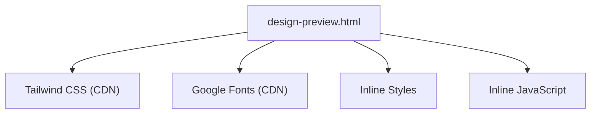
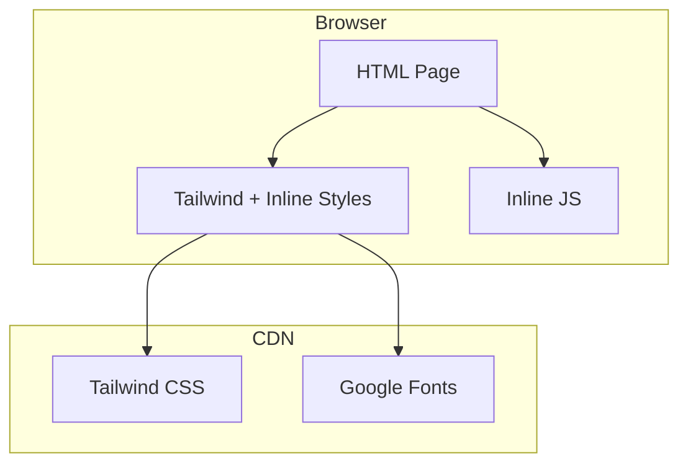
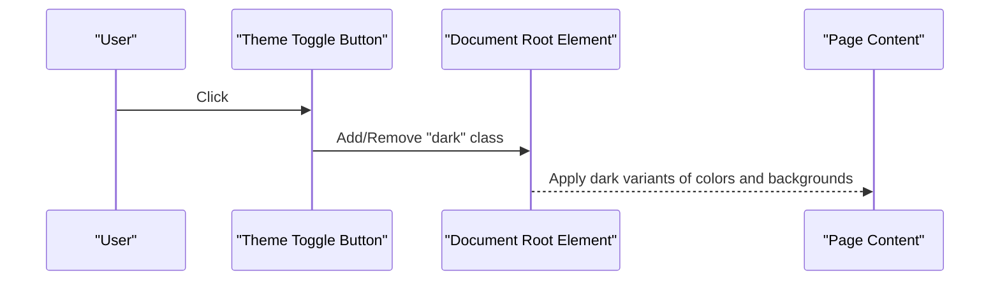
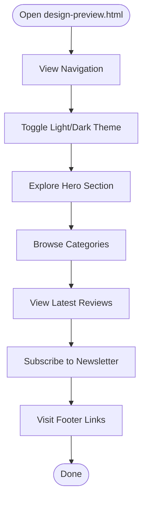
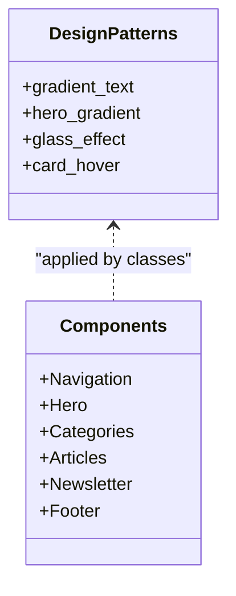
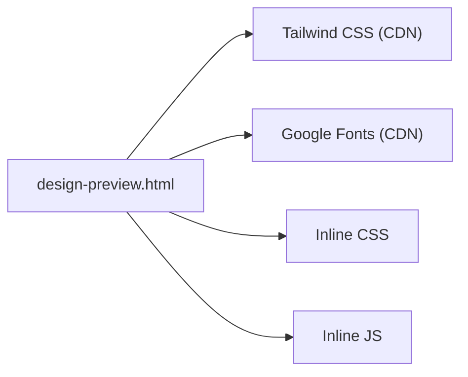

# Getting Started

<cite>
**Referenced Files in This Document**
- [design-preview.html](file://design-preview.html)
</cite>

## Table of Contents
1. [Introduction](#introduction)
2. [Project Structure](#project-structure)
3. [Core Components](#core-components)
4. [Architecture Overview](#architecture-overview)
5. [Detailed Component Analysis](#detailed-component-analysis)
6. [Dependency Analysis](#dependency-analysis)
7. [Performance Considerations](#performance-considerations)
8. [Troubleshooting Guide](#troubleshooting-guide)
9. [Conclusion](#conclusion)

## Introduction
This guide helps you quickly run and explore the TechReview Blog preview. It is a static HTML page that requires no build tools or dependencies. You can open the design-preview.html file directly in any modern web browser to view the site in action. The preview demonstrates a product review website layout with responsive design, light/dark theme switching, and interactive elements such as hover effects and category filtering.

## Project Structure
The project is a single-file static website built with Tailwind CSS and Google Fonts. There are no separate assets or build scripts—everything is included inline or loaded via CDN.

**Diagram sources**
- [design-preview.html:7](file://design-preview.html#L7)
- [design-preview.html:8](file://design-preview.html#L8)
- [design-preview.html:31](file://design-preview.html#L31)
- [design-preview.html:450](file://design-preview.html#L450)

**Section sources**
- [design-preview.html:1](file://design-preview.html#L1-L456)

## Core Components
- Static HTML structure with semantic sections for navigation, hero, categories, latest reviews, featured article, newsletter, and footer.
- Tailwind CSS configured for dark mode using a class-based approach.
- Inline styles define reusable design patterns (gradient text, hero gradients, card hover effects, and glass effect).
- Minimal JavaScript toggles the dark theme by adding/removing a class on the root element.

Key interactive elements:
- Theme switch button toggles between light and dark themes.
- Navigation links and buttons use hover states for feedback.
- Category cards and article cards have hover animations and transitions.

**Section sources**
- [design-preview.html:58](file://design-preview.html#L58)
- [design-preview.html:74](file://design-preview.html#L74)
- [design-preview.html:450](file://design-preview.html#L450)

## Architecture Overview
The preview is a client-side-only application. It loads Tailwind and fonts from CDNs, applies a custom Tailwind configuration, and uses inline CSS and JS for styling and interactivity.

**Diagram sources**
- [design-preview.html:7](file://design-preview.html#L7)
- [design-preview.html:8](file://design-preview.html#L8)
- [design-preview.html:31](file://design-preview.html#L31)
- [design-preview.html:450](file://design-preview.html#L450)

## Detailed Component Analysis

### Light/Dark Theme Mode
- The dark mode is controlled by a class on the root element. The Tailwind configuration enables a class-based dark mode.
- The theme toggle button switches the class on the root element, instantly applying dark styles to all components.

**Diagram sources**
- [design-preview.html:80](file://design-preview.html#L80)
- [design-preview.html:450](file://design-preview.html#L450)

**Section sources**
- [design-preview.html:10](file://design-preview.html#L10)
- [design-preview.html:58](file://design-preview.html#L58)
- [design-preview.html:450](file://design-preview.html#L450)

### Navigation and Sections
- Navigation bar includes logo, category links, search icon, and theme toggle.
- Hero section showcases a gradient background with call-to-action buttons.
- Featured categories and latest reviews sections demonstrate responsive grids and hover effects.
- Newsletter and footer provide complementary CTAs and links.

**Section sources**
- [design-preview.html:60](file://design-preview.html#L60)
- [design-preview.html:93](file://design-preview.html#L93)
- [design-preview.html:124](file://design-preview.html#L124)
- [design-preview.html:172](file://design-preview.html#L172)
- [design-preview.html:385](file://design-preview.html#L385)
- [design-preview.html:400](file://design-preview.html#L400)

### Reusable Design Patterns
- Gradient text and hero gradients for visual appeal.
- Glass effect for semi-transparent overlays with backdrop blur.
- Card hover animation with elevation and shadow transitions.
- Responsive grid layouts for categories and articles.

**Diagram sources**
- [design-preview.html:31](file://design-preview.html#L31)
- [design-preview.html:93](file://design-preview.html#L93)
- [design-preview.html:124](file://design-preview.html#L124)
- [design-preview.html:172](file://design-preview.html#L172)
- [design-preview.html:385](file://design-preview.html#L385)
- [design-preview.html:400](file://design-preview.html#L400)

**Section sources**
- [design-preview.html:31](file://design-preview.html#L31)
- [design-preview.html:41](file://design-preview.html#L41)

## Dependency Analysis
- External dependencies:
  - Tailwind CSS loaded from CDN for utility-first styling.
  - Google Fonts loaded from CDN for typography.
- Internal dependencies:
  - Inline CSS defines reusable design tokens and effects.
  - Inline JavaScript provides the theme toggle function.

**Diagram sources**
- [design-preview.html:7](file://design-preview.html#L7)
- [design-preview.html:8](file://design-preview.html#L8)
- [design-preview.html:31](file://design-preview.html#L31)
- [design-preview.html:450](file://design-preview.html#L450)

**Section sources**
- [design-preview.html:7](file://design-preview.html#L7)
- [design-preview.html:8](file://design-preview.html#L8)
- [design-preview.html:31](file://design-preview.html#L31)
- [design-preview.html:450](file://design-preview.html#L450)

## Performance Considerations
- The preview is a static HTML file with minimal overhead. Opening it directly avoids server setup and reduces latency.
- CDN-hosted assets (Tailwind and fonts) improve caching and delivery speed.
- Inline CSS and JS keep render-blocking minimal for this single-page layout.

[No sources needed since this section provides general guidance]

## Troubleshooting Guide
- Cannot open the file locally:
  - Ensure you are opening the file in a modern browser and not through a local file protocol restriction. Some browsers restrict certain features when loading files locally. Consider serving via a simple local server if needed.
- Dark mode does not switch:
  - Verify the theme toggle button is clickable and that the root element receives the dark class. Confirm that the inline script is present and functional.
- Fonts or styles appear incorrect:
  - Check that the CDN links for Tailwind and Google Fonts are reachable. If network restrictions apply, consider hosting these assets locally.

**Section sources**
- [design-preview.html:450](file://design-preview.html#L450)

## Conclusion
You can run the TechReview Blog preview immediately by opening design-preview.html in any modern browser. It requires zero build tools or dependencies. Explore the light/dark theme toggle, responsive sections, and interactive elements to understand the design patterns. Use this preview as a foundation to build similar product review websites, leveraging the reusable components and design tokens demonstrated here.