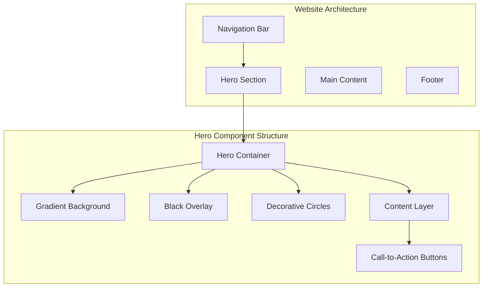
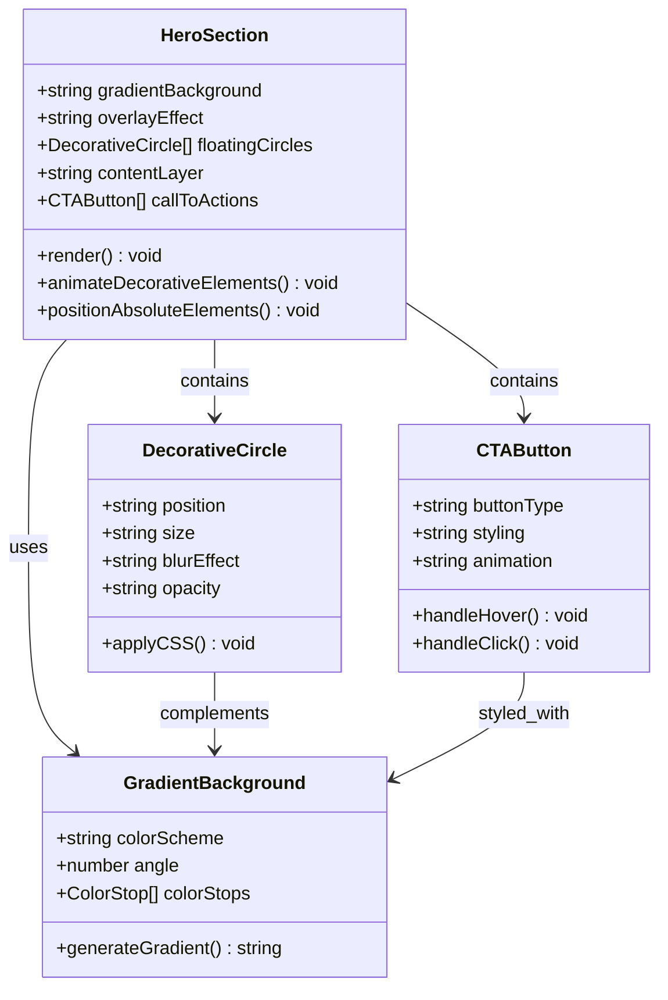
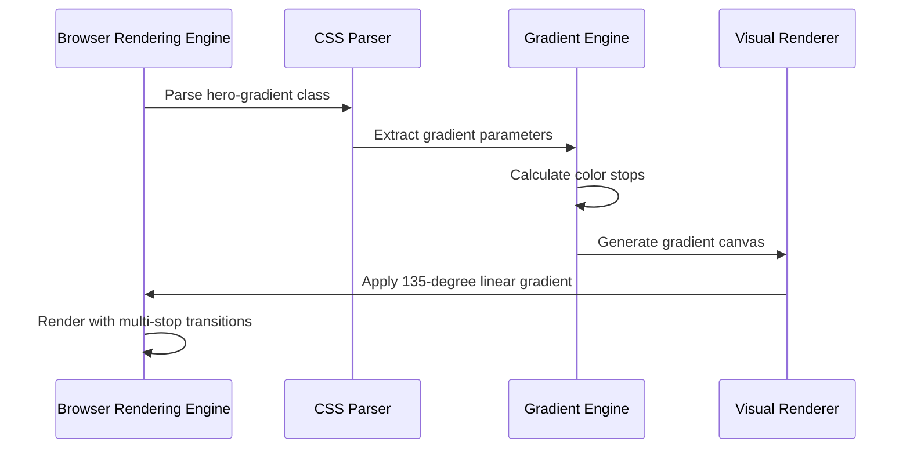
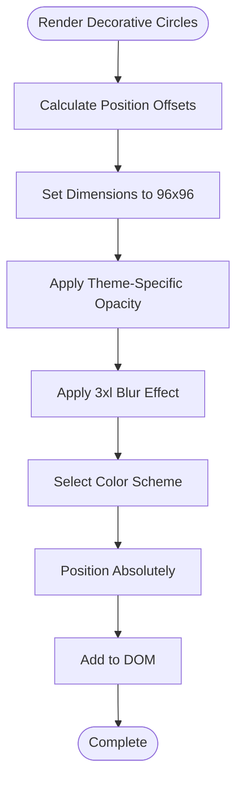
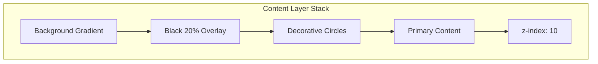
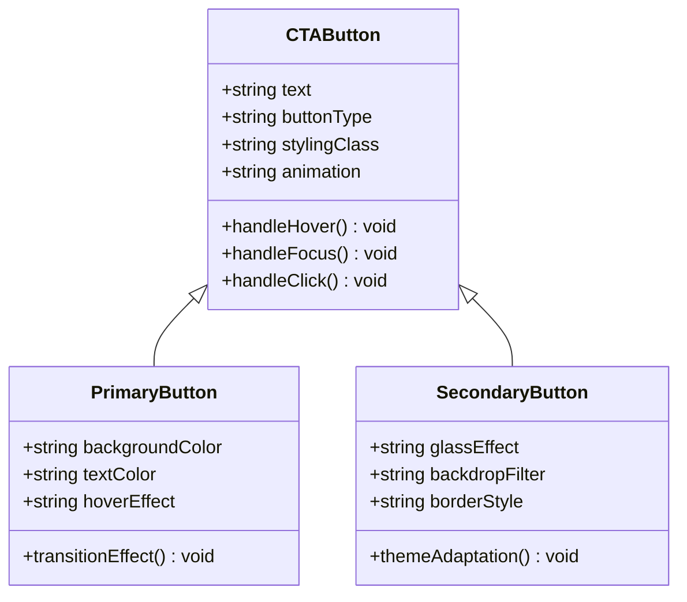
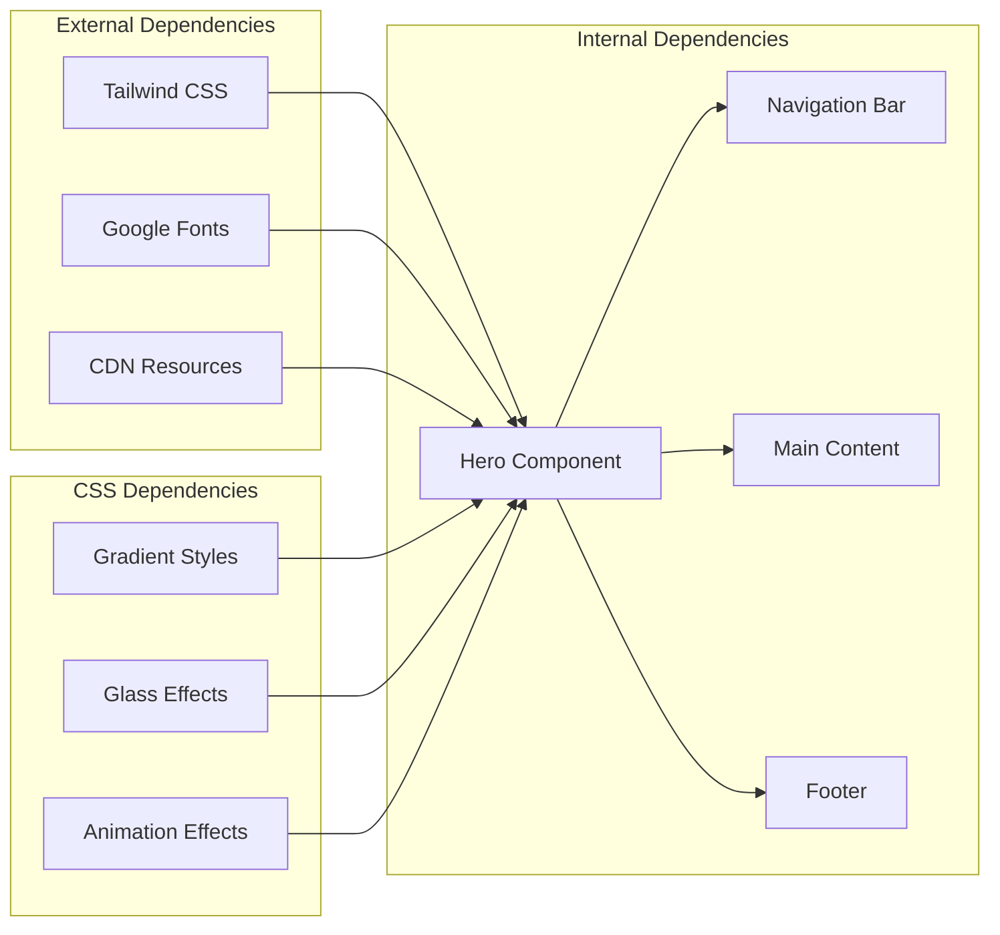

# Hero Section

<cite>
**Referenced Files in This Document**
- [design-preview.html](file://design-preview.html)
</cite>

## Table of Contents
1. [Introduction](#introduction)
2. [Project Structure](#project-structure)
3. [Core Components](#core-components)
4. [Architecture Overview](#architecture-overview)
5. [Detailed Component Analysis](#detailed-component-analysis)
6. [Dependency Analysis](#dependency-analysis)
7. [Performance Considerations](#performance-considerations)
8. [Troubleshooting Guide](#troubleshooting-guide)
9. [Conclusion](#conclusion)

## Introduction
The hero section serves as the digital storefront for TechReview, establishing brand identity through sophisticated visual design while driving user engagement via clear call-to-action pathways. This component combines gradient backgrounds, animated decorative elements, and layered content structures to create a premium user experience that emphasizes professionalism and objectivity in product evaluation.

## Project Structure
The hero section is implemented within a comprehensive website architecture that prioritizes modern design principles and responsive accessibility. The component integrates seamlessly with the overall site structure, utilizing Tailwind CSS for utility-first styling and custom CSS for advanced visual effects.

**Diagram sources**
- [design-preview.html:93-122](file://design-preview.html#L93-L122)

**Section sources**
- [design-preview.html:93-122](file://design-preview.html#L93-L122)

## Core Components

### Gradient Background Implementation
The hero section employs a sophisticated CSS linear gradient background that transitions from deep purples to vibrant blues, creating a visually striking foundation that aligns with the TechReview brand identity. The gradient implementation utilizes a 135-degree angle with carefully selected color stops to achieve optimal visual appeal.

**Gradient Specifications:**
- Color Scheme: Purple (#667eea) → Blue (#764ba2) → Pink (#f093fb)
- Angle: 135 degrees
- Transition: Multi-stop gradient for depth and dimensionality
- Background Type: Linear gradient background

### Animated Decorative Elements
Floating blurred circles serve as dynamic visual anchors that draw attention while maintaining visual harmony. These elements utilize CSS backdrop blur effects and strategic positioning to create depth without overwhelming the primary content.

**Decorative Element Properties:**
- Size: 96x96 rem units (96w x 96h)
- Opacity: 10% white for light theme, 20% purple for dark theme
- Blur Effect: 3xl blur radius (64px)
- Positioning: Absolute positioning outside content boundaries
- Animation: Static with smooth transitions on hover

### Layered Content Structure
The hero section implements a sophisticated z-index stacking system that ensures proper layering of background elements, decorative overlays, and primary content. This hierarchical approach maintains readability while enhancing visual depth.

**Layer Composition:**
1. Base Gradient Background
2. Dark Overlay (20% opacity black)
3. Floating Decorative Circles
4. Primary Content Layer (z-index: 10)
5. Call-to-Action Buttons

**Section sources**
- [design-preview.html:38-40](file://design-preview.html#L38-L40)
- [design-preview.html:96-119](file://design-preview.html#L96-L119)

## Architecture Overview

**Diagram sources**
- [design-preview.html:38-40](file://design-preview.html#L38-L40)
- [design-preview.html:96-119](file://design-preview.html#L96-L119)

## Detailed Component Analysis

### Gradient Background System

The gradient background implementation represents the cornerstone of the hero section's visual identity. This sophisticated background employs a multi-stop linear gradient that transitions from deep purple (#667eea) through blue (#764ba2) to pink (#f093fb), creating a sense of depth and sophistication.

**Diagram sources**
- [design-preview.html:38-40](file://design-preview.html#L38-L40)

**Gradient Implementation Details:**
- **Angle**: 135 degrees for diagonal emphasis
- **Color Stops**: Strategic placement for visual balance
- **Performance**: Hardware-accelerated rendering
- **Accessibility**: Maintains sufficient contrast ratios

### Decorative Circle System

The floating decorative circles represent a key element of the hero section's dynamic visual appeal. These elements utilize advanced CSS backdrop blur effects and absolute positioning to create depth and movement within the design.

**Diagram sources**
- [design-preview.html:98-99](file://design-preview.html#L98-L99)

**Circle Specifications:**
- **Size**: 96x96 rem units (consistent across breakpoints)
- **Blur Radius**: 3xl (64px blur intensity)
- **Positioning**: Negative offsets (-24rem) for off-screen appearance
- **Theme Adaptation**: White for light theme, purple for dark theme

### Content Layer Architecture

The content layer establishes the primary messaging and call-to-action elements within the hero section. This layer utilizes a sophisticated z-index system to ensure proper stacking order and visual hierarchy.

**Diagram sources**
- [design-preview.html:96-119](file://design-preview.html#L96-L119)

**Content Layer Features:**
- **Typography Hierarchy**: 4xl to 6xl scaling from mobile to desktop
- **Promotional Messaging**: Professional, objective brand positioning
- **Visual Effects**: Glass effect for secondary actions
- **Responsive Design**: Adaptive text sizing and spacing

### Call-to-Action Button System

The hero section implements a dual-button strategy that balances immediate action with consideration for user preference. This approach reflects the brand's commitment to providing valuable information without aggressive sales tactics.

**Diagram sources**
- [design-preview.html:111-118](file://design-preview.html#L111-L118)

**Button Specifications:**
- **Primary Button**: Solid white background with dark text
- **Secondary Button**: Glass effect with backdrop blur
- **Animation**: Smooth transitions on hover states
- **Accessibility**: Sufficient contrast ratios maintained

**Section sources**
- [design-preview.html:96-119](file://design-preview.html#L96-L119)
- [design-preview.html:111-118](file://design-preview.html#L111-L118)

## Dependency Analysis

The hero section demonstrates excellent architectural separation with minimal coupling between components. The design leverages external dependencies while maintaining internal cohesion.

**Diagram sources**
- [design-preview.html:7-8](file://design-preview.html#L7-L8)
- [design-preview.html:31-57](file://design-preview.html#L31-L57)

**Section sources**
- [design-preview.html:7-8](file://design-preview.html#L7-L8)
- [design-preview.html:31-57](file://design-preview.html#L31-L57)

## Performance Considerations

The hero section implementation prioritizes performance through several optimization strategies:

### Rendering Performance
- **Hardware Acceleration**: CSS transforms and opacity changes leverage GPU acceleration
- **Efficient Gradients**: Single gradient background reduces paint operations
- **Minimal DOM Nodes**: Optimized structure reduces layout calculations

### Memory Management
- **Static Elements**: Decorative circles remain static, avoiding frequent reflows
- **CSS Variables**: Centralized color management reduces memory overhead
- **Lazy Loading**: Content below the fold loads progressively

### Network Optimization
- **CDN Resources**: External libraries loaded from optimized CDNs
- **Font Loading**: Asynchronous font loading prevents render blocking
- **Critical Path**: Essential styles included inline for fast initial render

## Troubleshooting Guide

### Common Issues and Solutions

**Gradient Not Rendering Properly**
- Verify CSS class application: `hero-gradient`
- Check browser compatibility for linear gradient syntax
- Ensure proper vendor prefixes for older browsers

**Decorative Circles Not Visible**
- Confirm absolute positioning with negative offsets
- Verify z-index stacking order
- Check theme-specific opacity values

**Button Hover Effects Not Working**
- Validate CSS hover pseudo-class selectors
- Ensure proper z-index positioning
- Check for conflicting CSS rules

**Typography Scaling Issues**
- Verify responsive breakpoint classes
- Check font family fallbacks
- Ensure proper viewport meta tag configuration

**Section sources**
- [design-preview.html:38-40](file://design-preview.html#L38-L40)
- [design-preview.html:98-99](file://design-preview.html#L98-L99)
- [design-preview.html:111-118](file://design-preview.html#L111-L118)

## Conclusion

The hero section component exemplifies modern web design principles through its sophisticated gradient background, animated decorative elements, and layered content structure. The implementation successfully balances visual appeal with functional effectiveness, creating a premium user experience that reinforces TechReview's brand identity as a professional, objective product evaluation platform.

The component's thoughtful use of z-index stacking, positioning absolute elements, and responsive typography hierarchy demonstrates a deep understanding of both design aesthetics and user experience principles. The dual call-to-action strategy reflects the brand's commitment to providing valuable information while encouraging user engagement through clear, non-pushy pathways.

Through careful attention to performance optimization, accessibility considerations, and cross-browser compatibility, this hero section serves as both a visual showcase and a functional gateway to the broader TechReview ecosystem, establishing strong foundations for continued user engagement and brand recognition.