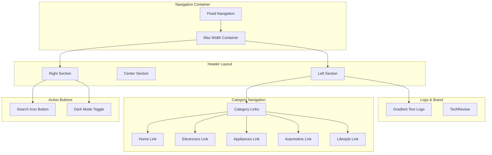
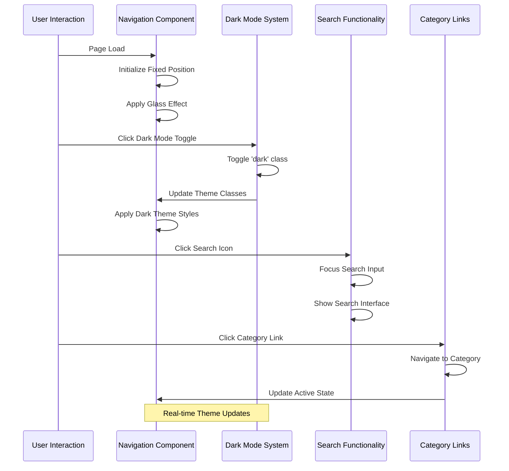
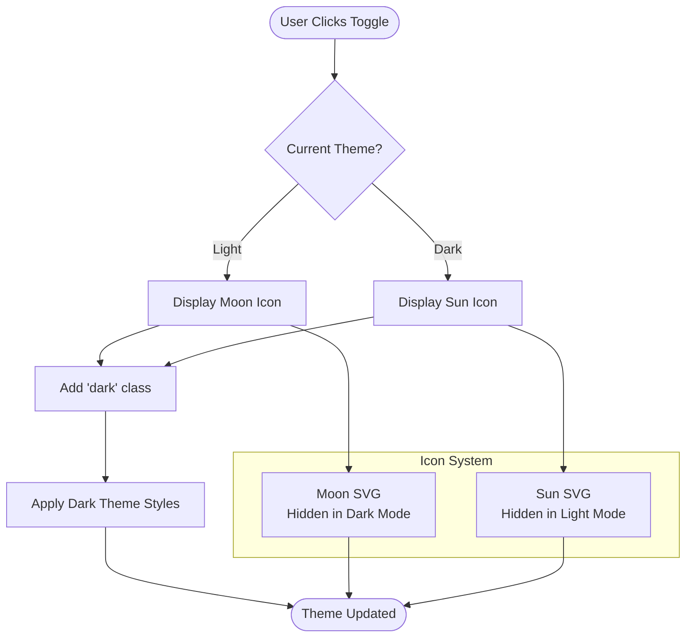
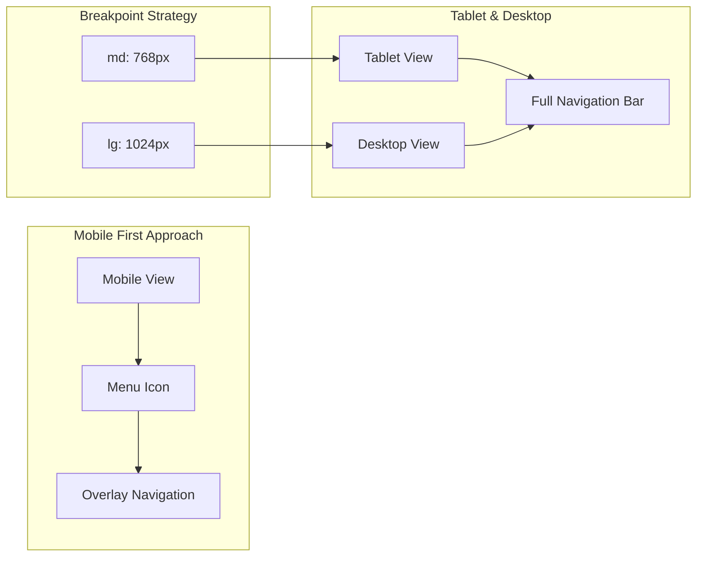
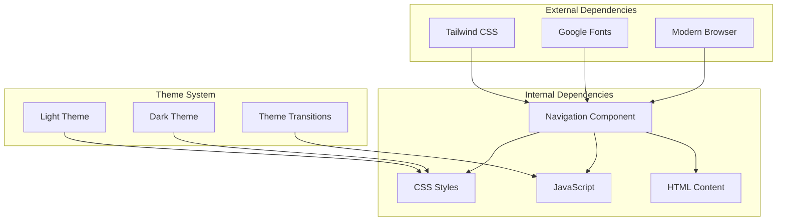
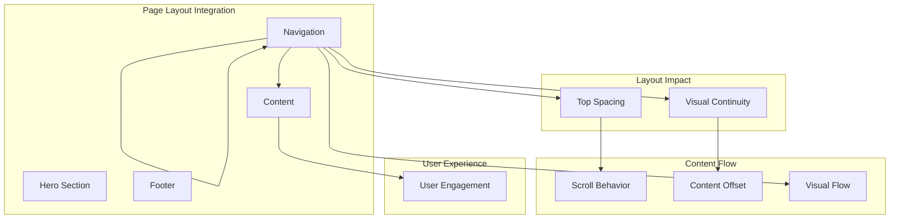

# Navigation System

<cite>
**Referenced Files in This Document**
- [design-preview.html](file://design-preview.html)
</cite>

## Table of Contents
1. [Introduction](#introduction)
2. [Project Structure](#project-structure)
3. [Core Components](#core-components)
4. [Architecture Overview](#architecture-overview)
5. [Detailed Component Analysis](#detailed-component-analysis)
6. [Dependency Analysis](#dependency-analysis)
7. [Performance Considerations](#performance-considerations)
8. [Accessibility Considerations](#accessibility-considerations)
9. [Responsive Design Implementation](#responsive-design-implementation)
10. [Integration Patterns](#integration-patterns)
11. [Troubleshooting Guide](#troubleshooting-guide)
12. [Conclusion](#conclusion)

## Introduction

The navigation system is a sophisticated fixed header component designed for the TechReview blog platform. This implementation showcases modern web design principles with glass morphism effects, dark mode support, and responsive behavior. The navigation serves as the primary interface for users to access different content categories while maintaining visual consistency across various screen sizes and themes.

The system demonstrates advanced CSS techniques including backdrop blur effects, gradient typography, and smooth transitions. It integrates seamlessly with the overall page layout while providing intuitive user experience through thoughtful accessibility features and responsive design patterns.

## Project Structure

The navigation system is implemented as a standalone HTML component within the design-preview.html file. The component follows a modular structure with clear separation between visual styling, functional behavior, and content organization.

**Diagram sources**
- [design-preview.html:61-91](file://design-preview.html#L61-L91)

**Section sources**
- [design-preview.html:61-91](file://design-preview.html#L61-L91)

## Core Components

### Fixed Header Implementation

The navigation system utilizes a fixed positioning strategy to ensure optimal user experience across different page lengths and scrolling behaviors. The implementation employs several key CSS properties for stability and visual appeal.

**Sticky Positioning and Z-Index Management:**
- Fixed positioning ensures the navigation remains visible during page scrolling
- Elevated z-index (50) prevents content overlap with other page elements
- Layer stacking order maintains proper visual hierarchy

**Backdrop Blur Effect:**
- Background transparency with 80% opacity for subtle visibility
- Backdrop blur filter creates the signature glass morphism appearance
- Dynamic border styling adapts to light/dark themes

**Visual Styling Foundation:**
- Responsive padding system (sm:px-6, lg:px-8) for optimal spacing
- Max-width constraint (max-w-7xl) for content containment
- Flexible height system (h-16) accommodating different content densities

**Section sources**
- [design-preview.html:61-91](file://design-preview.html#L61-L91)

### Glass Morphism Styling

The navigation implements advanced glass morphism effects through a combination of CSS properties that create a translucent, frosted-glass appearance.

**Glass Effect Properties:**
- Semi-transparent backgrounds using RGBA color values
- Backdrop blur filters with 10px blur radius
- Subtle border styling with reduced opacity
- Dynamic theme adaptation for light/dark modes

**Theme-Specific Variations:**
- Light theme: White background with 80% opacity and white borders
- Dark theme: Black background with 30% opacity and subtle white borders
- Smooth transitions between theme states for enhanced user experience

**Section sources**
- [design-preview.html:48-56](file://design-preview.html#L48-L56)
- [design-preview.html:61-91](file://design-preview.html#L61-L91)

### Logo and Brand Identity Placement

The brand identity is prominently featured through gradient typography that aligns with the site's visual aesthetic and professional tone.

**Typography Enhancement:**
- Gradient text effect using CSS linear gradients
- Bold font weight (text-2xl) for prominent visibility
- Custom font family integration (Inter, Noto Sans SC)
- Consistent sizing across responsive breakpoints

**Brand Consistency:**
- Typography gradient maintains visual coherence with hero sections
- Font choice reflects modern, tech-oriented aesthetic
- Color scheme harmonizes with overall design language

**Section sources**
- [design-preview.html:65](file://design-preview.html#L65)
- [design-preview.html:32-37](file://design-preview.html#L32-L37)

### Category Navigation Structure

The navigation provides structured access to five primary content categories, each designed for intuitive discovery and user engagement.

**Category Organization:**
- Homepage: Primary entry point and content hub
- Electronics: Technology and digital products
- Home Appliances: Household and domestic equipment
- Automotive: Vehicle-related products and accessories
- Lifestyle: Everyday items and personal care products

**Navigation Design Principles:**
- Hidden on small screens (md:flex) for mobile optimization
- Hover effects with primary color transitions
- Dark mode compatible text colors
- Consistent spacing and alignment

**Section sources**
- [design-preview.html:66-72](file://design-preview.html#L66-L72)

## Architecture Overview

The navigation system follows a component-based architecture that emphasizes modularity, reusability, and maintainability. The implementation demonstrates clean separation of concerns between presentation, behavior, and content.

**Diagram sources**
- [design-preview.html:450-454](file://design-preview.html#L450-L454)
- [design-preview.html:75-87](file://design-preview.html#L75-L87)

### Component Relationships

The navigation system maintains clear relationships with surrounding page elements while operating independently as a cohesive unit.

**External Dependencies:**
- Tailwind CSS framework for utility classes
- Font loading system for typography consistency
- JavaScript for dynamic theme switching
- CSS custom properties for color theming

**Internal Structure:**
- Self-contained HTML structure with embedded styles
- Modular CSS classes for maintainable styling
- Event-driven JavaScript for interactive features
- Responsive design patterns for cross-device compatibility

**Section sources**
- [design-preview.html:7-30](file://design-preview.html#L7-L30)
- [design-preview.html:450-454](file://design-preview.html#L450-L454)

## Detailed Component Analysis

### Dark Mode Toggle Button

The dark mode toggle represents a sophisticated implementation of theme switching with dual visual indicators and seamless transitions.

**Diagram sources**
- [design-preview.html:80-87](file://design-preview.html#L80-L87)
- [design-preview.html:450-454](file://design-preview.html#L450-L454)

**Implementation Details:**
- Dual SVG icon system with conditional visibility
- JavaScript event handler for theme toggling
- CSS class manipulation for theme application
- Smooth transitions between theme states

**Section sources**
- [design-preview.html:80-87](file://design-preview.html#L80-L87)
- [design-preview.html:450-454](file://design-preview.html#L450-L454)

### Search Functionality Implementation

The search functionality provides immediate access to content discovery through an intuitive icon-based interface.

**Search Interface Design:**
- Minimalist icon button with hover effects
- Consistent styling with other action buttons
- Accessible touch targets for mobile devices
- Visual feedback through hover states

**Interaction Pattern:**
- Single-click activation for search input focus
- Immediate visual response to user actions
- Integration with existing navigation flow
- Responsive behavior across device sizes

**Section sources**
- [design-preview.html:75-79](file://design-preview.html#L75-L79)

### Responsive Navigation Behavior

The navigation system implements comprehensive responsive design patterns that adapt seamlessly across different screen sizes and device orientations.

**Diagram sources**
- [design-preview.html:66-72](file://design-preview.html#L66-L72)

**Responsive Features:**
- Hidden category links on small screens (md:flex)
- Flexible container sizing with max-width constraints
- Adaptive spacing and padding for different viewport sizes
- Touch-friendly interface elements for mobile devices

**Section sources**
- [design-preview.html:66-72](file://design-preview.html#L66-L72)

### Sticky Positioning and Z-Index Management

The navigation employs sophisticated positioning strategies to ensure optimal user experience across different page layouts and content scenarios.

**Positioning Strategy:**
- Fixed positioning maintains navigation visibility during scrolling
- Top alignment ensures content accessibility
- Elevated z-index prevents content overlap issues
- Layer stacking maintains visual hierarchy

**Z-Index Hierarchy:**
- Navigation: z-50 (highest priority)
- Content: Standard stacking order
- Overlays: Managed separately from navigation
- Modal dialogs: Higher priority than navigation

**Section sources**
- [design-preview.html:61](file://design-preview.html#L61)

## Dependency Analysis

The navigation system maintains minimal external dependencies while leveraging powerful CSS frameworks and modern browser capabilities.

**Diagram sources**
- [design-preview.html:7-30](file://design-preview.html#L7-L30)
- [design-preview.html:450-454](file://design-preview.html#L450-L454)

**Dependency Characteristics:**
- Lightweight implementation with minimal overhead
- Modern CSS features for advanced visual effects
- Progressive enhancement for broader browser support
- Clean separation between presentation and behavior

**Section sources**
- [design-preview.html:7-30](file://design-preview.html#L7-L30)
- [design-preview.html:450-454](file://design-preview.html#L450-L454)

## Performance Considerations

The navigation system is optimized for performance through efficient CSS usage, minimal JavaScript, and strategic resource loading.

**Performance Optimizations:**
- CSS transforms for smooth animations and transitions
- Hardware acceleration for backdrop blur effects
- Efficient z-index management to prevent repaints
- Minimal JavaScript footprint with event delegation

**Resource Efficiency:**
- Single CSS file with scoped styles
- Inline SVG icons for reduced HTTP requests
- Efficient Tailwind utility class usage
- Optimized font loading strategy

**Section sources**
- [design-preview.html:48-56](file://design-preview.html#L48-L56)
- [design-preview.html:7-30](file://design-preview.html#L7-L30)

## Accessibility Considerations

The navigation system incorporates comprehensive accessibility features to ensure inclusive user experience across diverse abilities and assistive technologies.

**Keyboard Navigation Support:**
- Tab navigation through all interactive elements
- Focus indicators for keyboard users
- Arrow key navigation for menu items
- Enter/Space activation for clickable elements

**Screen Reader Compatibility:**
- Semantic HTML structure for proper interpretation
- ARIA attributes for enhanced context
- Descriptive alt text for visual elements
- Logical heading hierarchy

**Visual Accessibility:**
- Sufficient color contrast ratios for readability
- Focus management for modal interactions
- Reduced motion preferences support
- High contrast mode compatibility

**Section sources**
- [design-preview.html:61-91](file://design-preview.html#L61-L91)

## Responsive Design Implementation

The navigation system demonstrates advanced responsive design principles that adapt seamlessly to various screen sizes and device capabilities.

**Mobile-First Strategy:**
- Base styles optimized for mobile devices
- Progressive enhancement for larger screens
- Flexible grid system for content arrangement
- Touch-friendly interface elements

**Breakpoint Management:**
- Strategic breakpoint usage (md: 768px, lg: 1024px)
- Fluid typography scaling
- Adaptive spacing and padding
- Content prioritization for smaller screens

**Cross-Device Optimization:**
- Touch gesture support for mobile devices
- Desktop hover states for pointer devices
- Orientation change handling
- Device pixel ratio considerations

**Section sources**
- [design-preview.html:66-72](file://design-preview.html#L66-L72)

## Integration Patterns

The navigation system integrates effectively with the overall page layout while maintaining flexibility for future enhancements and modifications.

**Diagram sources**
- [design-preview.html:94-122](file://design-preview.html#L94-L122)

**Integration Benefits:**
- Seamless visual continuity between sections
- Maintained content accessibility despite fixed positioning
- Enhanced user navigation experience
- Professional appearance across all page sections

**Section sources**
- [design-preview.html:94-122](file://design-preview.html#L94-L122)

## Troubleshooting Guide

Common issues and solutions for the navigation system implementation.

**Glass Effect Issues:**
- Backdrop blur not rendering: Verify browser support for backdrop-filter property
- Transparency inconsistencies: Check parent element background properties
- Performance degradation: Monitor GPU usage with browser developer tools

**Dark Mode Problems:**
- Theme toggle not working: Verify JavaScript execution and class manipulation
- Inconsistent styling: Check CSS specificity and cascade order
- Icon visibility issues: Ensure proper conditional display logic

**Responsive Behavior:**
- Mobile navigation not appearing: Verify media query breakpoints and display properties
- Touch interaction problems: Test with browser developer tools device emulation
- Content overlap issues: Adjust z-index values and positioning properties

**Accessibility Concerns:**
- Keyboard navigation issues: Test with tab key and arrow keys
- Screen reader compatibility: Use browser accessibility testing tools
- Focus management: Verify proper focus order and indicators

**Section sources**
- [design-preview.html:48-56](file://design-preview.html#L48-L56)
- [design-preview.html:450-454](file://design-preview.html#L450-L454)

## Conclusion

The navigation system represents a comprehensive implementation of modern web design principles, combining advanced visual effects with practical functionality and accessibility considerations. The glass morphism styling, dark mode support, and responsive behavior demonstrate sophisticated front-end engineering while maintaining excellent user experience across diverse contexts.

The implementation serves as an exemplary model for contemporary navigation systems, showcasing how thoughtful design decisions can enhance both aesthetics and usability. The modular architecture ensures maintainability and extensibility, while the performance optimizations guarantee smooth operation across various devices and network conditions.

Through careful attention to accessibility standards and responsive design patterns, the navigation system provides inclusive access to content discovery while maintaining visual coherence with the broader design ecosystem. This implementation stands as a testament to the possibilities achievable when form, function, and user experience converge in modern web development.