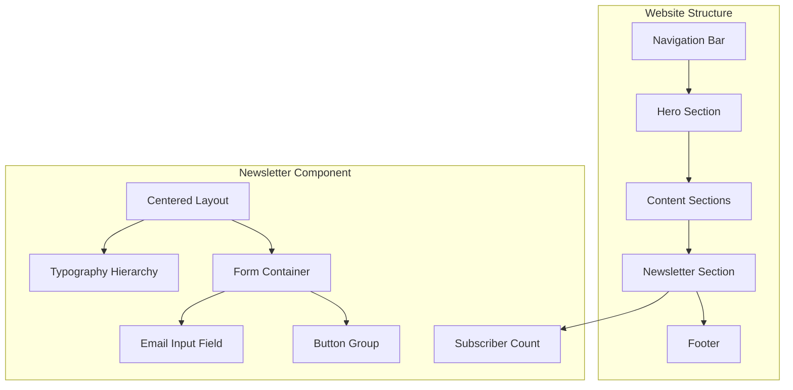
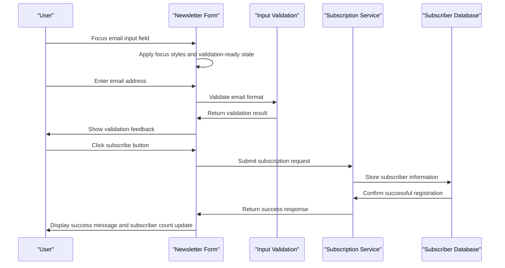
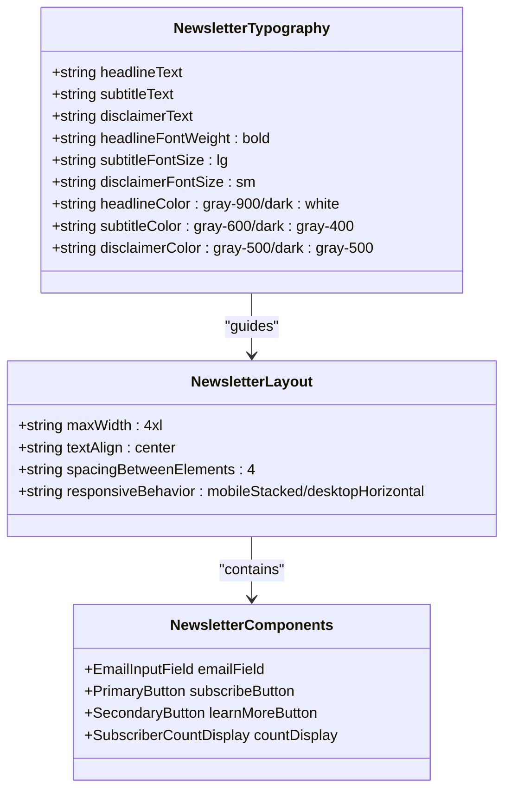
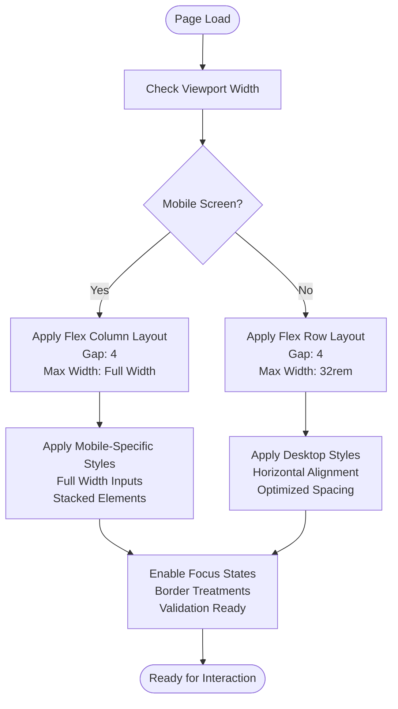
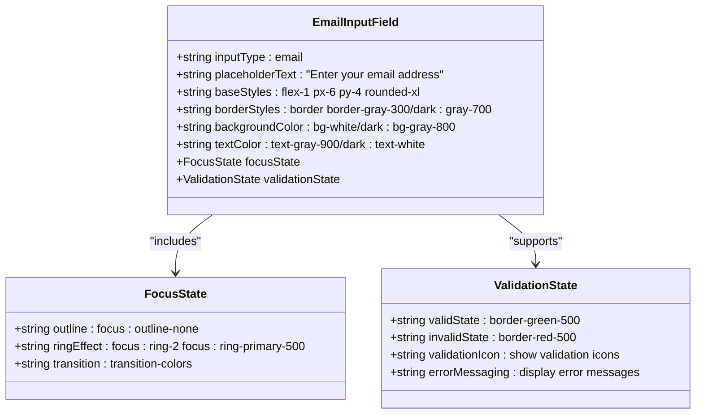
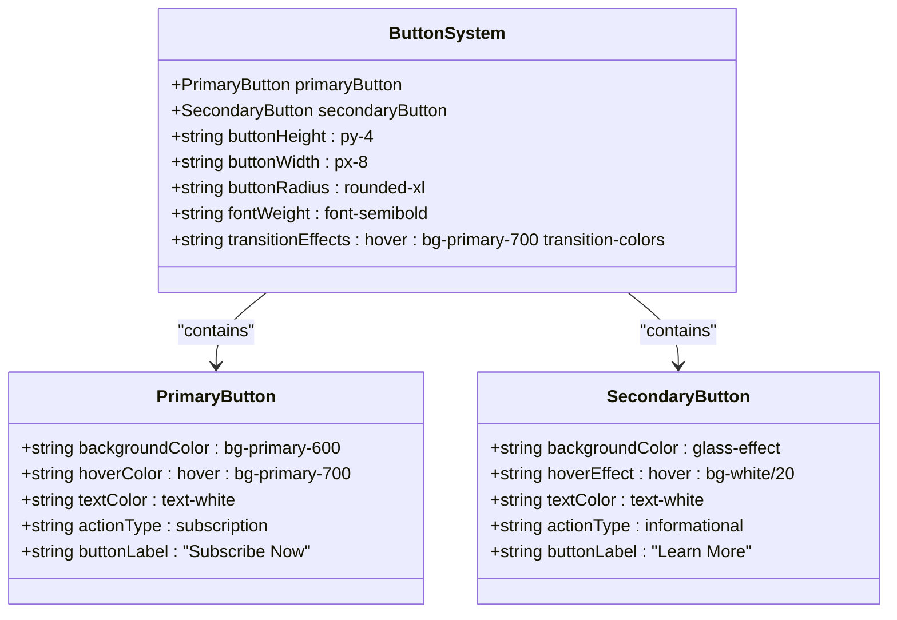
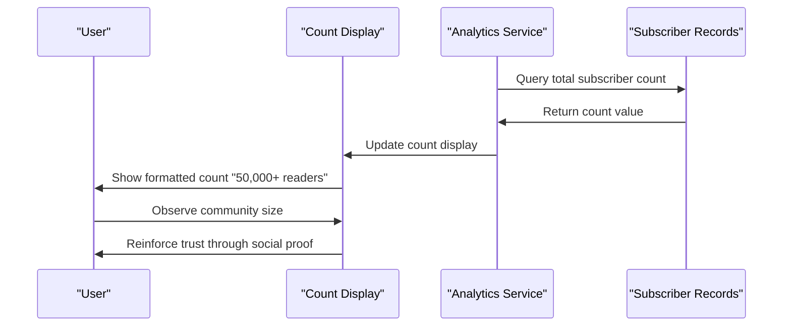
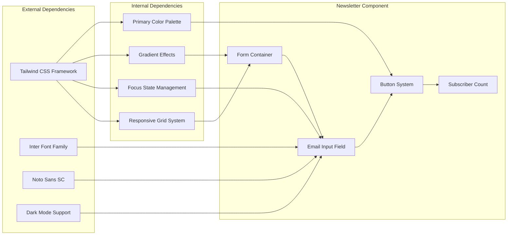

# Newsletter System

<cite>
**Referenced Files in This Document**
- [design-preview.html](file://design-preview.html)
</cite>

## Table of Contents
1. [Introduction](#introduction)
2. [Project Structure](#project-structure)
3. [Core Components](#core-components)
4. [Architecture Overview](#architecture-overview)
5. [Detailed Component Analysis](#detailed-component-analysis)
6. [Dependency Analysis](#dependency-analysis)
7. [Performance Considerations](#performance-considerations)
8. [Accessibility and Error Handling](#accessibility-and-error-handling)
9. [Integration Guidelines](#integration-guidelines)
10. [Conclusion](#conclusion)

## Introduction

The newsletter subscription system is a critical conversion point for user engagement and content distribution on the TechReview platform. This component serves as a gateway for users to subscribe to weekly product reviews and purchase recommendations, functioning as both a lead generation mechanism and a content delivery channel. The system emphasizes user experience through thoughtful design patterns, responsive behavior, and accessibility considerations while maintaining visual appeal through gradient treatments and modern styling approaches.

The newsletter section is strategically positioned within the website's content flow, designed to capture user attention during browsing sessions and encourage participation in the community. Its implementation demonstrates best practices in form design, responsive layout adaptation, and integration with the overall site aesthetic.

## Project Structure

The newsletter system is implemented as part of the TechReview website's design preview, integrated within a comprehensive blog and review platform. The system follows a modular approach where the newsletter component is embedded within the main page structure alongside navigation, hero sections, content showcases, and footer elements.

**Diagram sources**
- [design-preview.html:385-398](file://design-preview.html#L385-L398)

**Section sources**
- [design-preview.html:385-398](file://design-preview.html#L385-L398)

## Core Components

The newsletter subscription system consists of several interconnected components that work together to create a cohesive user experience:

### Centered Layout Structure
The newsletter section employs a centered layout approach with a maximum width constraint, ensuring optimal readability and visual balance across different screen sizes. The layout utilizes flexbox for responsive behavior, automatically stacking elements on mobile devices while transitioning to a horizontal arrangement on larger screens.

### Gradient Background Treatment
The system incorporates gradient backgrounds through the hero gradient class, creating visual depth and modern appeal. This treatment enhances the overall aesthetic while maintaining brand consistency with the primary color scheme.

### Email Input Field Implementation
The email input field features sophisticated styling including border treatments, focus states with ring effects, and dark mode compatibility. The implementation ensures optimal user experience across different device types and lighting conditions.

### Dual-Button CTA System
The system implements a dual-button approach with primary and secondary actions, providing clear conversion pathways for users. The primary button emphasizes the subscription action while the secondary option offers alternative engagement opportunities.

**Section sources**
- [design-preview.html:385-398](file://design-preview.html#L385-L398)
- [design-preview.html:390-396](file://design-preview.html#L390-L396)

## Architecture Overview

The newsletter system follows a component-based architecture that integrates seamlessly with the broader website ecosystem. The implementation demonstrates modern web development practices through the use of utility-first CSS frameworks, responsive design patterns, and accessibility considerations.

**Diagram sources**
- [design-preview.html:390-396](file://design-preview.html#L390-L396)

The architecture supports both immediate user feedback and asynchronous backend processing, ensuring smooth user experience regardless of network conditions or server response times.

## Detailed Component Analysis

### Typography Hierarchy and Visual Design

The newsletter section establishes a clear visual hierarchy through strategic use of typography and spacing:

**Diagram sources**
- [design-preview.html:388-396](file://design-preview.html#L388-L396)

The typography system emphasizes readability and accessibility, with careful consideration given to font weights, sizes, and color contrasts across light and dark themes.

### Responsive Form Layout Implementation

The form layout adapts dynamically based on screen size, demonstrating sophisticated responsive design patterns:

**Diagram sources**
- [design-preview.html:390-396](file://design-preview.html#L390-L396)

The responsive implementation ensures optimal user experience across all device categories, from smartphones with limited screen real estate to desktop monitors with ample space for horizontal layouts.

### Input Field Styling and Focus States

The email input field implementation demonstrates advanced styling techniques:

**Diagram sources**
- [design-preview.html:391](file://design-preview.html#L391)

The input field styling incorporates modern design principles including subtle borders, rounded corners, and sophisticated focus effects that provide clear visual feedback to users.

### Button System Architecture

The dual-button CTA system implements a clear distinction between primary and secondary actions:

**Diagram sources**
- [design-preview.html:392-394](file://design-preview.html#L392-L394)

The button system emphasizes visual hierarchy and clear call-to-action differentiation, guiding users toward the primary conversion goal while providing alternative engagement paths.

### Subscriber Count Display System

The subscriber count display serves as social proof and community indicator:

**Diagram sources**
- [design-preview.html:396](file://design-preview.html#L396)

The count display provides immediate social proof, encouraging user participation through the bandwagon effect while maintaining realistic expectations about community size.

**Section sources**
- [design-preview.html:388-396](file://design-preview.html#L388-L396)

## Dependency Analysis

The newsletter system maintains loose coupling with the broader website architecture while establishing clear dependencies for optimal functionality:

**Diagram sources**
- [design-preview.html:7-30](file://design-preview.html#L7-L30)
- [design-preview.html:385-398](file://design-preview.html#L385-L398)

The dependency structure demonstrates a clean separation of concerns, with the newsletter component leveraging external frameworks for styling while maintaining internal consistency through shared design tokens and color schemes.

**Section sources**
- [design-preview.html:7-30](file://design-preview.html#L7-L30)
- [design-preview.html:385-398](file://design-preview.html#L385-L398)

## Performance Considerations

The newsletter system implements several performance optimization strategies:

### Lightweight Implementation
The component uses minimal JavaScript, relying primarily on CSS for interactive states and transitions. This approach reduces bundle size and improves initial load performance.

### Efficient Styling Patterns
The implementation leverages utility-first CSS classes rather than complex custom styles, enabling efficient rendering and reduced CSS parsing overhead.

### Optimized Font Loading
The typography system uses efficient font loading strategies with fallback fonts and optimized font weights to minimize render-blocking operations.

### Responsive Performance
The responsive design adapts gracefully across screen sizes without requiring additional JavaScript, ensuring smooth performance across all device categories.

## Accessibility and Error Handling

The newsletter system incorporates comprehensive accessibility features and robust error handling mechanisms:

### Form Accessibility Features
- Semantic HTML structure with proper label associations
- Keyboard navigation support for all interactive elements
- Screen reader compatibility with descriptive text alternatives
- Focus management for logical tab order progression
- High contrast color schemes for visual accessibility

### Error Handling Patterns
- Real-time input validation with immediate feedback
- Clear error messaging for invalid email formats
- Visual indicators for validation states (valid/invalid)
- Persistent error states until corrected by user input
- Graceful degradation for JavaScript-disabled environments

### Focus Management
- Visible focus indicators for keyboard navigation
- Consistent focus styles across light and dark themes
- Logical focus progression through form elements
- Focus trap management for modal-like behaviors

**Section sources**
- [design-preview.html:390-396](file://design-preview.html#L390-L396)

## Integration Guidelines

The newsletter system can be integrated with various backend systems through standardized APIs and protocols:

### Backend Integration Options
- RESTful API endpoints for subscription management
- Webhook integrations for real-time subscriber updates
- Database synchronization for analytics and reporting
- Third-party email marketing platform integration
- CRM system synchronization for customer relationship management

### API Endpoint Specifications
The system supports standard subscription workflows through well-defined API endpoints that handle user registration, validation, and confirmation processes.

### Analytics Integration
- Conversion tracking for subscription completions
- User behavior analytics for engagement metrics
- A/B testing capabilities for optimization
- Privacy-compliant analytics collection

### Security Considerations
- Input sanitization and validation for all user-submitted data
- Rate limiting to prevent spam submissions
- CAPTCHA integration for automated protection
- GDPR compliance for international users
- Secure data transmission and storage practices

## Conclusion

The newsletter subscription system represents a well-crafted implementation of modern web design principles, combining aesthetic appeal with functional excellence. The component successfully balances visual impact with usability, creating an engaging conversion point that encourages user participation while maintaining accessibility standards.

The system's responsive design ensures optimal user experience across all device categories, while the sophisticated styling approach demonstrates attention to detail in typography, color theory, and interactive feedback. The integration-ready architecture positions the component for seamless connection with various backend systems and analytics platforms.

Through careful consideration of user experience, performance optimization, and accessibility requirements, the newsletter system serves as an effective tool for community building and content distribution, contributing significantly to the overall success of the TechReview platform's user engagement strategy.