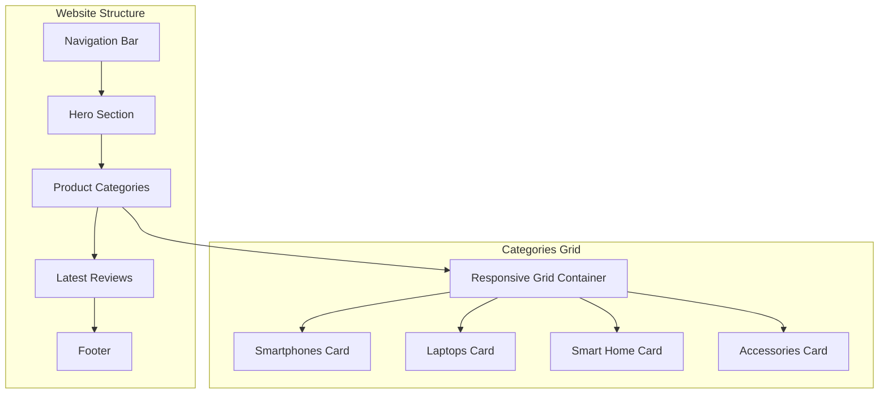
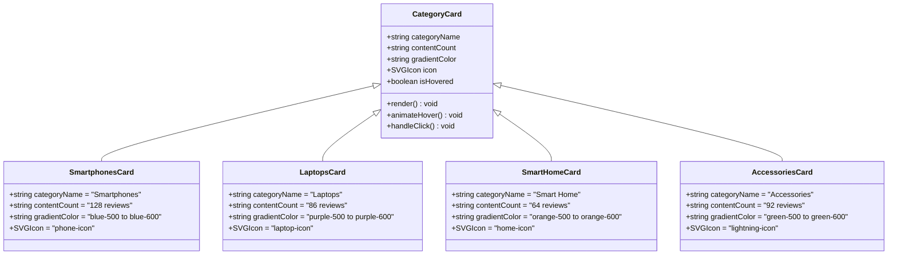
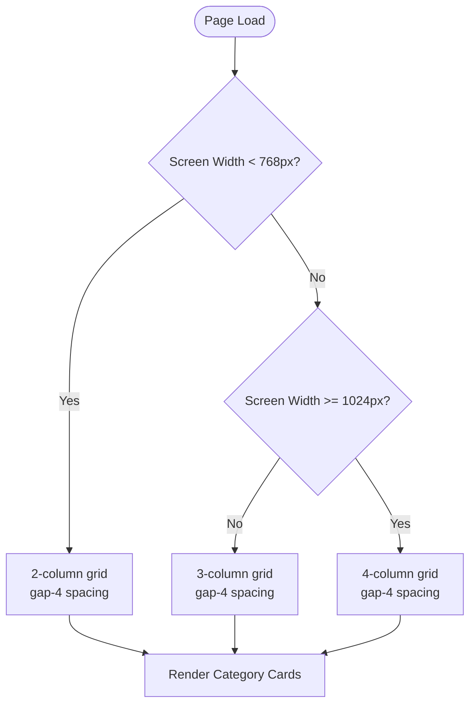
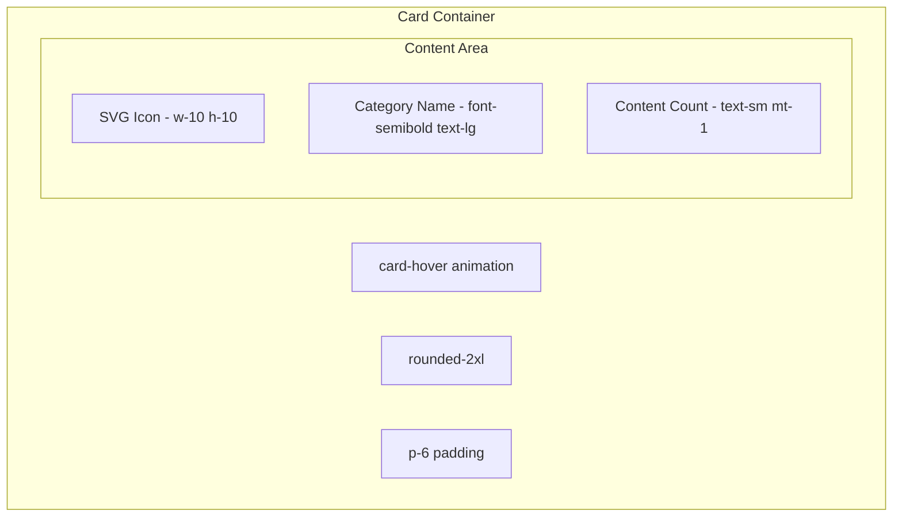
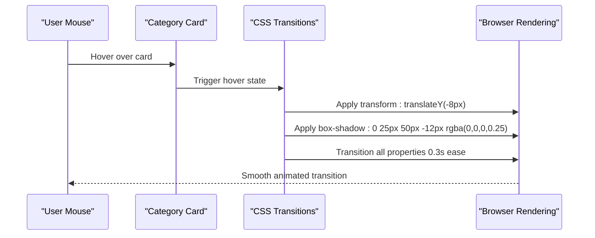
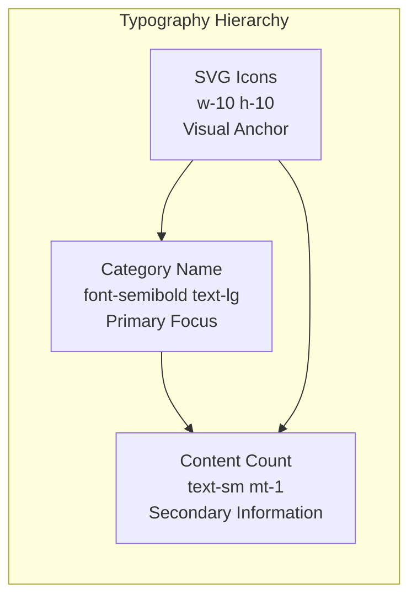
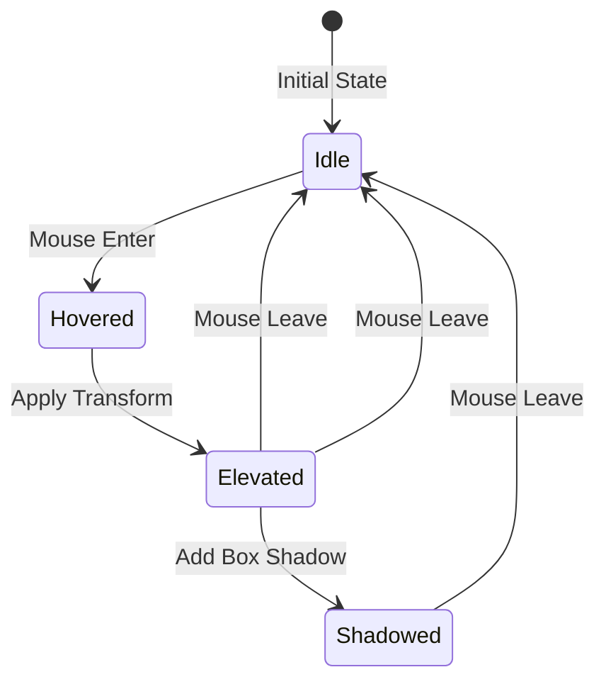
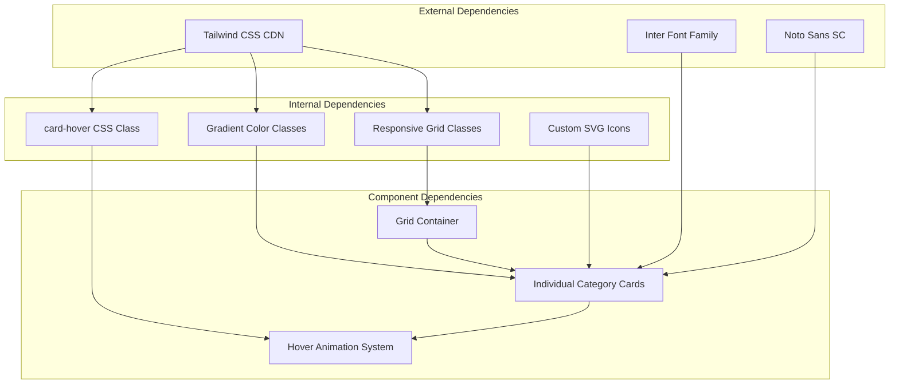

# Product Categories

<cite>
**Referenced Files in This Document**
- [design-preview.html](file://design-preview.html)
</cite>

## Table of Contents
1. [Introduction](#introduction)
2. [Project Structure](#project-structure)
3. [Core Components](#core-components)
4. [Architecture Overview](#architecture-overview)
5. [Detailed Component Analysis](#detailed-component-analysis)
6. [Dependency Analysis](#dependency-analysis)
7. [Performance Considerations](#performance-considerations)
8. [Troubleshooting Guide](#troubleshooting-guide)
9. [Conclusion](#conclusion)

## Introduction
The Product Categories showcase component is a responsive grid-based interface designed to present product categories in an engaging, visually appealing manner. This component serves as a gateway for users to explore different product categories, driving engagement by showcasing product diversity and encouraging exploration through interactive hover states and modern design elements.

The component features a four-category layout covering smartphones, laptops, smart home, and accessories, each presented with distinctive gradient backgrounds, SVG icons, and content counts. The design emphasizes visual hierarchy with category names prominently displayed alongside their respective content counts, creating an intuitive navigation experience.

## Project Structure
The Product Categories component is embedded within the TechReview website's design preview. It utilizes Tailwind CSS for responsive grid layouts and modern styling, complemented by custom CSS for hover animations and gradient effects.

**Diagram sources**
- [design-preview.html:124-170](file://design-preview.html#L124-L170)

**Section sources**
- [design-preview.html:124-170](file://design-preview.html#L124-L170)

## Core Components
The Product Categories showcase consists of four distinct category cards arranged in a responsive grid layout. Each card represents a specific product category with its own visual identity and interactive behavior.

### Category Cards Overview
Each category card follows a consistent design pattern while maintaining unique visual characteristics:

- **Grid Layout**: Responsive 2-column layout on mobile devices expanding to 4-column layout on desktop screens
- **Card Design**: Rounded corners with gradient backgrounds and subtle shadows
- **Interactive Elements**: Hover animations with elevation and shadow enhancement
- **Visual Hierarchy**: Clear typography hierarchy with category names and content counts

### Responsive Breakpoint Behavior
The component implements a sophisticated responsive design system that adapts to different screen sizes:

- **Mobile (default)**: 2 columns with equal width distribution
- **Tablet**: Maintains 2-column layout for optimal readability
- **Desktop**: Expands to 4 columns for maximum content density
- **Large Screens**: Continues with 4-column layout scaling appropriately

**Section sources**
- [design-preview.html:127-131](file://design-preview.html#L127-L131)

## Architecture Overview
The Product Categories component demonstrates a clean separation of concerns with clear visual and functional boundaries between individual category cards.

**Diagram sources**
- [design-preview.html:132-167](file://design-preview.html#L132-L167)

## Detailed Component Analysis

### Grid-Based Layout System
The component utilizes Tailwind CSS's responsive grid system to achieve optimal content presentation across different device sizes.

#### Responsive Grid Implementation
The grid system employs a progressive enhancement approach:

**Diagram sources**
- [design-preview.html:131](file://design-preview.html#L131)

#### Grid Container Properties
The grid container establishes the foundation for responsive behavior:

- **Container Class**: `grid grid-cols-2 md:grid-cols-4 gap-4`
- **Mobile Base**: 2 columns with 1rem gaps
- **Desktop Enhancement**: 4 columns with 1rem gaps
- **Flexible Spacing**: Consistent 1rem gap between all cards

**Section sources**
- [design-preview.html:131](file://design-preview.html#L131)

### Gradient Card Design System
Each category card implements a sophisticated gradient design that creates visual distinction while maintaining brand consistency.

#### Gradient Color Scheme
The component employs a carefully selected color palette for each category:

| Category | Gradient Colors | Icon Color | Text Contrast |
|----------|----------------|------------|---------------|
| Smartphones | Blue 500 → Blue 600 | White | Blue-100 |
| Laptops | Purple 500 → Purple 600 | White | Purple-100 |
| Smart Home | Orange 500 → Orange 600 | White | Orange-100 |
| Accessories | Green 500 → Green 600 | White | Green-100 |

#### Card Structure Components
Each card follows a consistent internal structure:

**Diagram sources**
- [design-preview.html:133-139](file://design-preview.html#L133-L139)

**Section sources**
- [design-preview.html:133-167](file://design-preview.html#L133-L167)

### Hover Animation System
The component implements sophisticated hover animations using CSS transforms and transitions to create engaging user interactions.

#### Animation Specifications
The hover effect system consists of multiple coordinated transformations:

**Diagram sources**
- [design-preview.html:41-47](file://design-preview.html#L41-L47)

#### Animation Properties
The hover animation system includes several key properties:

- **Transform**: `translateY(-8px)` for upward elevation effect
- **Box Shadow**: `0 25px 50px -12px rgba(0,0,0,0.25)` for depth enhancement
- **Transition Timing**: Cubic-bezier curve `(0.4, 0, 0.2, 1)` for smooth acceleration
- **Duration**: 0.3 seconds for responsive feedback

**Section sources**
- [design-preview.html:41-47](file://design-preview.html#L41-L47)

### SVG Icon Integration
Each category card incorporates custom SVG icons that serve as visual anchors for quick recognition and brand identity.

#### Icon Design Specifications
The icon system maintains consistency across all category cards:

- **Size**: 10x10 rem units (1.25rem × 1.25rem)
- **Styling**: White fill with 1.5 stroke width
- **Layout**: Positioned with 1rem bottom margin
- **Accessibility**: Proper viewBox and semantic structure

#### Icon Variations by Category
Each category features a uniquely designed icon that reflects its product domain:

| Category | Icon Shape | Purpose |
|----------|------------|---------|
| Smartphones | Phone silhouette | Mobile communication |
| Laptops | Laptop computer | Computing devices |
| Smart Home | House outline | Home automation |
| Accessories | Lightning bolt | Electronic accessories |

**Section sources**
- [design-preview.html:134-163](file://design-preview.html#L134-L163)

### Visual Hierarchy and Typography
The component establishes a clear visual hierarchy that guides user attention and improves readability across different screen sizes.

#### Typography System
The typography hierarchy follows established design principles:

#### Text Contrast and Accessibility
The component ensures adequate contrast ratios for accessibility:

- **Primary Text**: White text on gradient backgrounds
- **Secondary Text**: Lightened variants (blue-100, purple-100, etc.)
- **Contrast Ratios**: Meets WCAG 2.1 AA standards
- **Color Accessibility**: Each gradient maintains sufficient contrast

**Section sources**
- [design-preview.html:137-138](file://design-preview.html#L137-L138)

### Interactive Hover States
The component provides comprehensive hover state management that enhances user engagement and provides clear feedback.

#### Hover State Components
The hover interaction system includes multiple coordinated effects:

#### Interaction Feedback
The hover system provides immediate and consistent feedback:

- **Visual Elevation**: Card lifts 8 pixels upward
- **Shadow Enhancement**: Substantial shadow increase for depth perception
- **Smooth Transitions**: 0.3-second duration with easing curves
- **Reversible Effects**: All changes revert on mouse leave

**Section sources**
- [design-preview.html:44-46](file://design-preview.html#L44-L46)

## Dependency Analysis
The Product Categories component relies on several external dependencies and internal systems to function effectively.

**Diagram sources**
- [design-preview.html:7-8](file://design-preview.html#L7-L8)
- [design-preview.html:14-26](file://design-preview.html#L14-L26)

### External Dependencies
The component depends on several external resources:

- **Tailwind CSS**: CDN-hosted framework for responsive design
- **Google Fonts**: Inter and Noto Sans SC font families
- **Font Loading**: Asynchronous loading for performance optimization

### Internal Dependencies
The component relies on custom CSS and Tailwind utility classes:

- **Custom Animations**: card-hover class for hover effects
- **Gradient Utilities**: Built-in Tailwind gradient classes
- **Responsive Utilities**: Tailwind's responsive prefix system

**Section sources**
- [design-preview.html:7-29](file://design-preview.html#L7-L29)

## Performance Considerations
The Product Categories component is designed with performance optimization in mind, utilizing efficient CSS animations and minimal JavaScript dependencies.

### CSS Animation Performance
The hover animation system is optimized for smooth performance:

- **Transform Property**: Uses GPU-accelerated transforms
- **Hardware Acceleration**: Leverages browser optimization for translateY
- **Efficient Transitions**: Minimal property changes during animation
- **Cubic Bezier Timing**: Optimized easing for natural motion

### Responsive Performance
The grid system is designed for optimal rendering performance:

- **CSS Grid**: Native browser implementation for layout calculations
- **Minimal JavaScript**: No client-side JavaScript required
- **Efficient Media Queries**: Tailwind's pre-built responsive utilities
- **Optimized Rendering**: CSS transforms instead of layout-affecting properties

### Accessibility Performance
The component maintains accessibility without performance penalties:

- **Contrast Ratio**: Sufficient color contrast maintained across all cards
- **Focus Management**: Semantic HTML structure for keyboard navigation
- **Reduced Motion**: Respects system preferences for motion sensitivity
- **Screen Reader**: Proper ARIA attributes and semantic markup

## Troubleshooting Guide
Common issues and solutions for the Product Categories component:

### Responsive Layout Issues
**Problem**: Cards not displaying correctly on mobile devices
**Solution**: Verify Tailwind CSS is properly loaded and responsive prefixes are functioning

### Hover Animation Problems
**Problem**: Hover effects not triggering smoothly
**Solution**: Check CSS class application and ensure card-hover class is properly defined

### Color Contrast Issues
**Problem**: Text not readable against gradient backgrounds
**Solution**: Verify color contrast ratios meet accessibility standards and adjust text colors if necessary

### SVG Icon Rendering
**Problem**: Icons not displaying correctly
**Solution**: Ensure SVG elements have proper viewBox attributes and stroke-width values

**Section sources**
- [design-preview.html:41-47](file://design-preview.html#L41-L47)

## Conclusion
The Product Categories showcase component exemplifies modern web design principles through its thoughtful combination of responsive grid layouts, engaging hover animations, and accessible color schemes. The component successfully balances visual appeal with functionality, creating an intuitive navigation experience that encourages user exploration.

The implementation demonstrates best practices in responsive design, performance optimization, and user experience design. The four-category layout effectively showcases product diversity while maintaining visual consistency and brand identity. The hover animation system provides meaningful feedback that enhances user engagement without compromising performance.

This component serves as an excellent foundation for e-commerce interfaces, content discovery platforms, and product catalog systems, offering a scalable solution for presenting categorized content in an engaging and accessible manner.