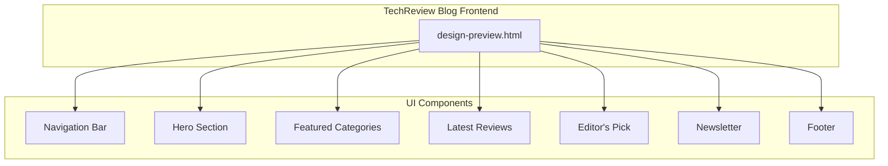
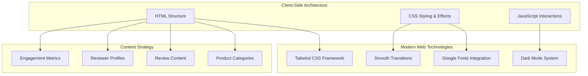
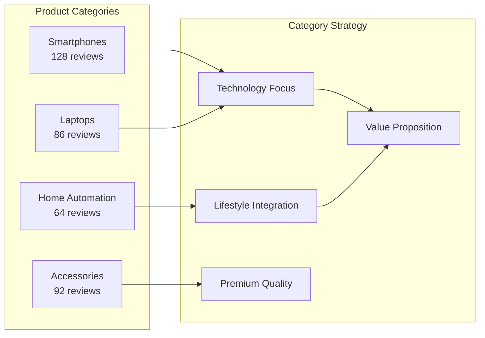
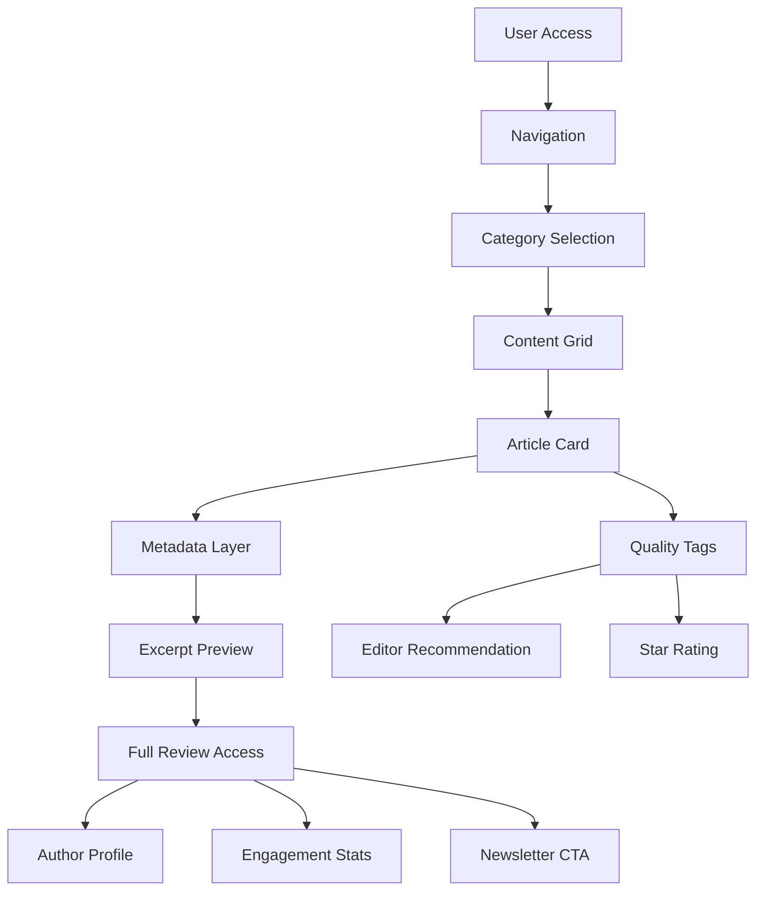
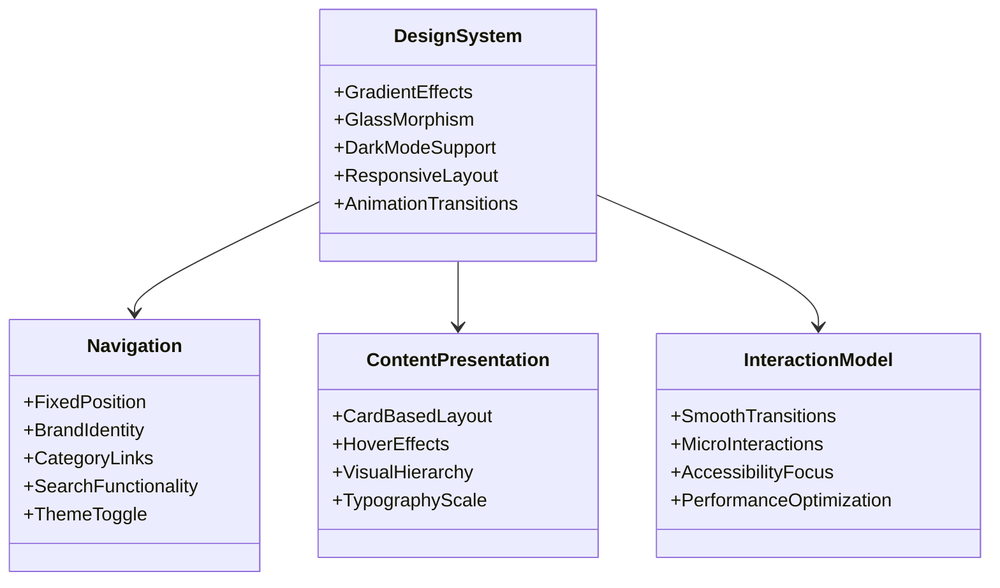
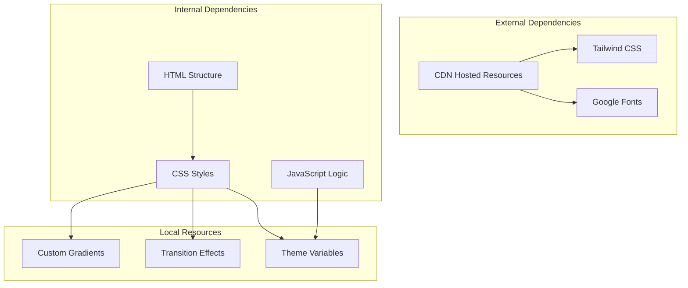

# Project Overview

<cite>
**Referenced Files in This Document**
- [design-preview.html](file://design-preview.html)
</cite>

## Table of Contents
1. [Introduction](#introduction)
2. [Project Structure](#project-structure)
3. [Core Components](#core-components)
4. [Architecture Overview](#architecture-overview)
5. [Detailed Component Analysis](#detailed-component-analysis)
6. [Dependency Analysis](#dependency-analysis)
7. [Performance Considerations](#performance-considerations)
8. [Troubleshooting Guide](#troubleshooting-guide)
9. [Conclusion](#conclusion)

## Introduction
TechReview Blog is a professional product review platform designed to help consumers make informed purchase decisions. The platform emphasizes expert product testing, objective reviews, and comprehensive coverage across multiple product categories. Its mission is to deliver detailed product evaluations that combine technical expertise with practical user insights, enabling users to confidently navigate the marketplace and select products that offer the best value.

The platform targets consumers who seek reliable, in-depth analysis before making purchases. By aggregating thousands of tested products across diverse categories, TechReview aims to become a trusted resource for quality-driven buying decisions.

## Project Structure
The repository contains a single HTML file that serves as a design preview and demonstration of the TechReview Blog frontend. This file encapsulates the complete user interface structure, showcasing the platform's modern aesthetic and usability principles.

**Diagram sources**
- [design-preview.html:60-91](file://design-preview.html#L60-L91)
- [design-preview.html:93-122](file://design-preview.html#L93-L122)
- [design-preview.html:124-170](file://design-preview.html#L124-L170)
- [design-preview.html:172-327](file://design-preview.html#L172-L327)
- [design-preview.html:329-383](file://design-preview.html#L329-L383)
- [design-preview.html:385-398](file://design-preview.html#L385-L398)
- [design-preview.html:400-448](file://design-preview.html#L400-L448)

**Section sources**
- [design-preview.html:1-456](file://design-preview.html#L1-L456)

## Core Components
The TechReview Blog frontend consists of several key components that work together to create a cohesive user experience focused on product discovery and evaluation.

### Navigation System
The navigation bar provides essential site access with brand identity, category links, search functionality, and theme switching capabilities. It maintains a fixed position at the top of the viewport for easy access across all pages.

### Hero Section
The hero section establishes the platform's value proposition through gradient backgrounds, compelling headline copy, and prominent call-to-action buttons. It communicates the core mission of helping users discover quality products.

### Category Showcase
The featured categories section highlights major product segments with visually distinct cards representing different product categories. Each category card includes iconography, category names, and content counts to guide user exploration.

### Content Display
The latest reviews section presents recent product evaluations in a responsive grid layout. Each article card includes category metadata, publication timing, author attribution, engagement metrics, and visual indicators for editorial picks.

### Editorial Features
The editor's pick section showcases premium content with enhanced presentation, including detailed product analysis, reviewer credentials, and star ratings to establish authority and trust.

### Community Engagement
The newsletter subscription area encourages user participation and ongoing engagement through email updates. The footer consolidates navigation, company information, and social media connections.

**Section sources**
- [design-preview.html:60-91](file://design-preview.html#L60-L91)
- [design-preview.html:93-122](file://design-preview.html#L93-L122)
- [design-preview.html:124-170](file://design-preview.html#L124-L170)
- [design-preview.html:172-327](file://design-preview.html#L172-L327)
- [design-preview.html:329-383](file://design-preview.html#L329-L383)
- [design-preview.html:385-398](file://design-preview.html#L385-L398)
- [design-preview.html:400-448](file://design-preview.html#L400-L448)

## Architecture Overview
The TechReview Blog follows a client-side architecture pattern where all functionality is contained within a single HTML file. This approach prioritizes simplicity, fast loading times, and reduced server overhead while maintaining modern web standards.

**Diagram sources**
- [design-preview.html:7](file://design-preview.html#L7)
- [design-preview.html:8](file://design-preview.html#L8)
- [design-preview.html:9-30](file://design-preview.html#L9-L30)
- [design-preview.html:450-454](file://design-preview.html#L450-L454)

The architecture emphasizes:
- **Modern Aesthetics**: Gradient effects, glass morphism, and smooth animations
- **Responsive Design**: Grid layouts adapting to different screen sizes
- **Performance Focus**: Single-file delivery minimizing HTTP requests
- **User Experience**: Intuitive navigation and clear content hierarchy

**Section sources**
- [design-preview.html:1-456](file://design-preview.html#L1-L456)

## Detailed Component Analysis

### Product Categories Coverage
TechReview Blog demonstrates comprehensive coverage across four primary product categories, each with distinct characteristics and target audiences:

**Diagram sources**
- [design-preview.html:131-168](file://design-preview.html#L131-L168)

Each category section includes:
- **Visual Identity**: Distinct color schemes and iconography
- **Content Volume**: Representative review counts indicating platform maturity
- **Target Market**: Clear positioning within the technology ecosystem

### Content Presentation Strategy
The platform employs a layered content presentation approach that balances accessibility with depth:

**Diagram sources**
- [design-preview.html:184-324](file://design-preview.html#L184-L324)
- [design-preview.html:333-381](file://design-preview.html#L333-L381)

**Section sources**
- [design-preview.html:124-170](file://design-preview.html#L124-L170)
- [design-preview.html:172-327](file://design-preview.html#L172-L327)
- [design-preview.html:329-383](file://design-preview.html#L329-L383)

### User Interface Design Philosophy
The interface design embodies modern web principles with attention to both visual appeal and functional usability:

**Diagram sources**
- [design-preview.html:31-57](file://design-preview.html#L31-L57)
- [design-preview.html:60-91](file://design-preview.html#L60-L91)
- [design-preview.html:172-327](file://design-preview.html#L172-L327)

Key design principles include:
- **Modern Aesthetics**: Gradient backgrounds, glass effects, and contemporary typography
- **Usability Focus**: Clear navigation, readable content hierarchy, and intuitive interactions
- **Performance Consciousness**: Optimized animations and minimal resource usage
- **Inclusive Design**: Dark mode support and accessible color contrast

**Section sources**
- [design-preview.html:31-57](file://design-preview.html#L31-L57)
- [design-preview.html:60-91](file://design-preview.html#L60-L91)

## Dependency Analysis
The TechReview Blog frontend has a minimal dependency footprint optimized for performance and maintainability:

**Diagram sources**
- [design-preview.html:7](file://design-preview.html#L7)
- [design-preview.html:8](file://design-preview.html#L8)
- [design-preview.html:9-30](file://design-preview.html#L9-L30)
- [design-preview.html:31-57](file://design-preview.html#L31-L57)
- [design-preview.html:450-454](file://design-preview.html#L450-L454)

Dependency characteristics:
- **Single HTML File**: Complete functionality in one deliverable
- **CDN Resources**: External hosting for framework and fonts
- **Minimal JavaScript**: Only essential interactivity (dark mode toggle)
- **Self-Contained Styling**: All CSS included within the HTML file

**Section sources**
- [design-preview.html:1-456](file://design-preview.html#L1-L456)

## Performance Considerations
The TechReview Blog architecture prioritizes performance through strategic design choices:

### Loading Optimization
- **Single File Delivery**: Eliminates multiple HTTP requests during initial load
- **CDN Hosting**: Leverages optimized delivery networks for external resources
- **Minimal JavaScript**: Only essential functionality (dark mode toggle) requires client-side scripting

### Rendering Efficiency
- **CSS-in-JS Approach**: Inline styles minimize DOM manipulation overhead
- **Hardware Acceleration**: CSS transforms and transitions utilize GPU acceleration
- **Responsive Images**: Placeholder graphics reduce bandwidth usage

### User Experience Performance
- **Instant Navigation**: Fixed navigation remains accessible without reloads
- **Smooth Animations**: Optimized transitions enhance perceived performance
- **Progressive Enhancement**: Core content renders immediately while enhancements load progressively

## Troubleshooting Guide
Common issues and solutions for the TechReview Blog frontend:

### Display Issues
- **Font Loading Problems**: Verify Google Fonts connectivity; fallback fonts are automatically applied
- **Color Theme Conflicts**: Check dark mode toggle functionality; ensure CSS variables are properly loaded
- **Layout Breakage**: Confirm viewport meta tag presence and responsive breakpoints

### Interactive Elements
- **Dark Mode Not Working**: Validate JavaScript execution and CSS class toggling
- **Navigation Links**: Ensure all anchor elements have proper href attributes
- **Button States**: Verify hover and active states are functioning correctly

### Performance Optimization
- **Resource Loading**: Monitor CDN availability and implement fallback strategies
- **Image Placeholders**: Confirm SVG fallbacks are rendering correctly
- **Animation Performance**: Test on various devices to ensure smooth transitions

**Section sources**
- [design-preview.html:450-454](file://design-preview.html#L450-L454)

## Conclusion
The TechReview Blog represents a well-crafted frontend solution that effectively communicates the platform's mission and values. Through its modern design philosophy, comprehensive content strategy, and performance-focused architecture, it creates an engaging experience for consumers seeking informed purchase decisions.

The single-file approach demonstrates the power of modern web technologies in delivering sophisticated functionality while maintaining simplicity and performance. The design system established in this preview provides a solid foundation for future development and expansion of the platform's capabilities.

Key strengths of the current implementation include:
- Clear value proposition communication
- Modern aesthetic design with practical usability
- Comprehensive category coverage demonstration
- Performance-optimized delivery architecture
- Scalable design system ready for future growth

This foundation positions TechReview Blog to effectively serve its target audience of consumers seeking reliable, in-depth product evaluations across multiple technology sectors.