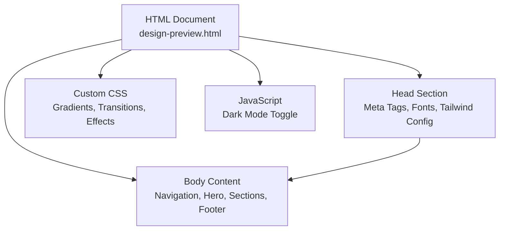
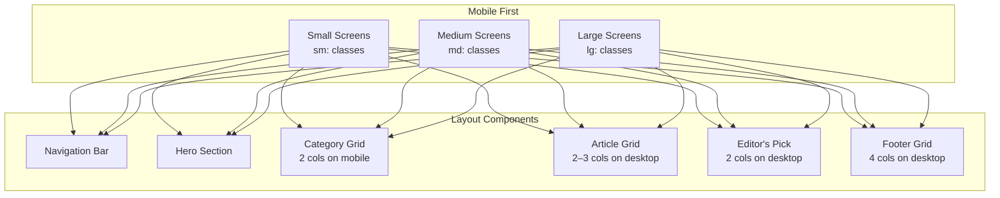
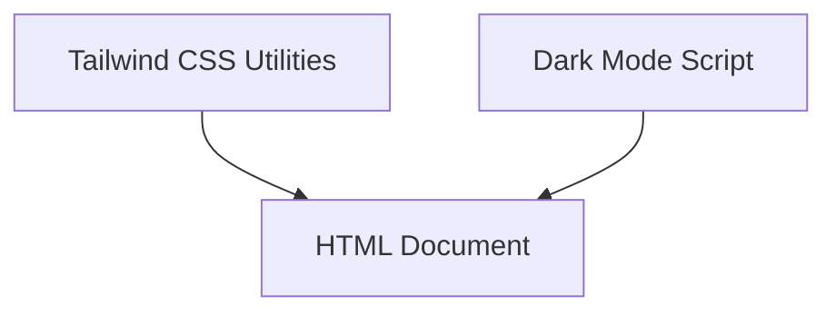

# Responsive Design & Mobile Experience

<cite>
**Referenced Files in This Document**
- [design-preview.html](file://design-preview.html)
</cite>

## Table of Contents
1. [Introduction](#introduction)
2. [Project Structure](#project-structure)
3. [Core Components](#core-components)
4. [Architecture Overview](#architecture-overview)
5. [Detailed Component Analysis](#detailed-component-analysis)
6. [Dependency Analysis](#dependency-analysis)
7. [Performance Considerations](#performance-considerations)
8. [Troubleshooting Guide](#troubleshooting-guide)
9. [Conclusion](#conclusion)

## Introduction
This document explains the responsive design implementation and mobile experience optimization demonstrated in the design preview. It focuses on the mobile-first approach using Tailwind's responsive prefix system (sm:, md:, lg:), breakpoint-specific layout adjustments, and touch-friendly interaction targets. It documents navigation behavior, grid system adaptation from single column on mobile to multiple columns on desktop, typography scaling across viewport sizes, component sizing adjustments, spacing modifications, and touch interaction optimization. It also covers performance considerations for mobile devices, loading optimization strategies, accessibility enhancements for mobile users, viewport meta tag configuration, responsive image handling, and maintaining usability across the full spectrum of device sizes.

## Project Structure
The project is a single HTML file that implements a complete responsive website using Tailwind CSS utility classes and a minimal amount of custom CSS. The structure follows a mobile-first approach with progressively enhanced layouts at larger breakpoints.

**Diagram sources**
- [design-preview.html:1-456](file://design-preview.html#L1-L456)

**Section sources**
- [design-preview.html:1-456](file://design-preview.html#L1-L456)

## Core Components
This section outlines the key responsive components and their mobile-first implementation:

- Viewport Meta Tag: Ensures proper scaling on mobile devices.
- Navigation Bar: Adapts from stacked layout to horizontal menu at larger screens.
- Hero Section: Responsive padding and typography scaling.
- Grid System: Single column on mobile, multiple columns on desktop.
- Typography: Font size and line height scaling across breakpoints.
- Interactive Elements: Touch-friendly sizing and spacing.
- Dark Mode: Smooth transitions for reduced eye strain on mobile.

Key implementation references:
- Viewport meta tag configuration: [design-preview.html:5](file://design-preview.html#L5)
- Tailwind configuration and dark mode: [design-preview.html:10-29](file://design-preview.html#L10-L29)
- Navigation bar with responsive classes: [design-preview.html:61-91](file://design-preview.html#L61-L91)
- Hero section responsive padding and typography: [design-preview.html:94-122](file://design-preview.html#L94-L122)
- Category grid responsive columns: [design-preview.html:131](file://design-preview.html#L131)
- Article grid responsive columns: [design-preview.html:184](file://design-preview.html#L184)
- Editor's pick responsive layout: [design-preview.html:334](file://design-preview.html#L334)
- Newsletter responsive form: [design-preview.html:390](file://design-preview.html#L390)
- Footer responsive grid: [design-preview.html:403](file://design-preview.html#L403)
- Dark mode toggle script: [design-preview.html:450-454](file://design-preview.html#L450-L454)

**Section sources**
- [design-preview.html:5](file://design-preview.html#L5)
- [design-preview.html:10-29](file://design-preview.html#L10-L29)
- [design-preview.html:61-91](file://design-preview.html#L61-L91)
- [design-preview.html:94-122](file://design-preview.html#L94-L122)
- [design-preview.html:131](file://design-preview.html#L131)
- [design-preview.html:184](file://design-preview.html#L184)
- [design-preview.html:334](file://design-preview.html#L334)
- [design-preview.html:390](file://design-preview.html#L390)
- [design-preview.html:403](file://design-preview.html#L403)
- [design-preview.html:450-454](file://design-preview.html#L450-L454)

## Architecture Overview
The responsive architecture relies on Tailwind’s utility-first approach with mobile-first breakpoints. The design progressively enhances layout and spacing as viewport width increases, while maintaining consistent typography scales and interactive element sizing.

**Diagram sources**
- [design-preview.html:61-91](file://design-preview.html#L61-L91)
- [design-preview.html:94-122](file://design-preview.html#L94-L122)
- [design-preview.html:131](file://design-preview.html#L131)
- [design-preview.html:184](file://design-preview.html#L184)
- [design-preview.html:334](file://design-preview.html#L334)
- [design-preview.html:403](file://design-preview.html#L403)

## Detailed Component Analysis

### Viewport Meta Tag Configuration
The viewport meta tag ensures the page renders at the device width with correct scaling, preventing zooming issues and enabling responsive behavior.

Implementation reference:
- [design-preview.html:5](file://design-preview.html#L5)

Best practices:
- Always include the viewport meta tag in the head section.
- Avoid fixed widths; use device-width for optimal scaling.

**Section sources**
- [design-preview.html:5](file://design-preview.html#L5)

### Navigation Behavior and Mobile Menu Considerations
The navigation bar uses a mobile-first approach:
- On small screens, the desktop menu links are hidden and replaced with a compact layout.
- On medium and larger screens, the desktop menu becomes visible.
- Interactive elements include search and dark mode toggles with appropriate touch targets.

Responsive classes:
- Desktop menu visibility: [design-preview.html:66](file://design-preview.html#L66)
- Navigation container padding: [design-preview.html:62](file://design-preview.html#L62)
- Dark mode toggle button: [design-preview.html:80-87](file://design-preview.html#L80-L87)

Touch-friendly interaction:
- Button padding and icon sizing are optimized for thumb reach.
- Hover states are preserved for pointer devices while maintaining tap targets.

**Section sources**
- [design-preview.html:61-91](file://design-preview.html#L61-L91)
- [design-preview.html:62](file://design-preview.html#L62)
- [design-preview.html:66](file://design-preview.html#L66)
- [design-preview.html:80-87](file://design-preview.html#L80-L87)

### Grid System Adaptation: Single Column to Multi-Column Layout
The grid system adapts from single column on mobile to multiple columns on desktop:
- Category cards: 2 columns on mobile, 4 columns on medium screens.
- Article cards: 1 column on mobile, 2 columns on medium, 3 columns on large screens.
- Editor’s pick: 1 column on mobile, 2 columns on medium.
- Footer: 1 column on mobile, 4 columns on medium.

Responsive classes:
- Category grid: [design-preview.html:131](file://design-preview.html#L131)
- Article grid: [design-preview.html:184](file://design-preview.html#L184)
- Editor’s pick: [design-preview.html:334](file://design-preview.html#L334)
- Footer grid: [design-preview.html:403](file://design-preview.html#L403)

Spacing and gutters:
- Consistent gap classes ensure readable spacing across breakpoints.
- Padding classes adjust for smaller screens to prevent cramped layouts.

**Section sources**
- [design-preview.html:131](file://design-preview.html#L131)
- [design-preview.html:184](file://design-preview.html#L184)
- [design-preview.html:334](file://design-preview.html#L334)
- [design-preview.html:403](file://design-preview.html#L403)

### Typography Scaling Across Viewport Sizes
Typography scales appropriately across breakpoints:
- Hero headline: larger on small screens, extra-large on medium screens.
- Section headings: consistent base size with slight scaling for emphasis.
- Body copy: legible sizes with improved line height on larger screens.
- Small text: reduced size for metadata and secondary information.

Responsive classes:
- Hero headline: [design-preview.html:105](file://design-preview.html#L105)
- Section headings: [design-preview.html:128](file://design-preview.html#L128), [design-preview.html:176](file://design-preview.html#L176), [design-preview.html:353](file://design-preview.html#L353)
- Body copy: [design-preview.html:108](file://design-preview.html#L108), [design-preview.html:357](file://design-preview.html#L357)
- Small text: [design-preview.html:198](file://design-preview.html#L198), [design-preview.html:244](file://design-preview.html#L244), [design-preview.html:292](file://design-preview.html#L292)

Accessibility considerations:
- Maintain sufficient contrast ratios for text.
- Prefer relative units for scalable typography.

**Section sources**
- [design-preview.html:105](file://design-preview.html#L105)
- [design-preview.html:128](file://design-preview.html#L128)
- [design-preview.html:176](file://design-preview.html#L176)
- [design-preview.html:353](file://design-preview.html#L353)
- [design-preview.html:108](file://design-preview.html#L108)
- [design-preview.html:357](file://design-preview.html#L357)
- [design-preview.html:198](file://design-preview.html#L198)
- [design-preview.html:244](file://design-preview.html#L244)
- [design-preview.html:292](file://design-preview.html#L292)

### Component Sizing Adjustments and Spacing Modifications
Components are sized for optimal readability and interaction:
- Cards: rounded corners and padding scale with screen size.
- Buttons: consistent padding and font weights for clear affordances.
- Images: aspect ratios maintained with responsive containers.

Responsive classes:
- Card padding and rounded corners: [design-preview.html:133](file://design-preview.html#L133), [design-preview.html:186](file://design-preview.html#L186)
- Button sizing: [design-preview.html:112](file://design-preview.html#L112), [design-preview.html:115](file://design-preview.html#L115), [design-preview.html:376](file://design-preview.html#L376)
- Aspect ratios: [design-preview.html:187](file://design-preview.html#L187), [design-preview.html:235](file://design-preview.html#L235), [design-preview.html:280](file://design-preview.html#L280), [design-preview.html:335](file://design-preview.html#L335)

Spacing modifications:
- Section paddings adapt to prevent excessive whitespace on small screens.
- Container widths and margins ensure content remains readable.

**Section sources**
- [design-preview.html:133](file://design-preview.html#L133)
- [design-preview.html:186](file://design-preview.html#L186)
- [design-preview.html:112](file://design-preview.html#L112)
- [design-preview.html:115](file://design-preview.html#L115)
- [design-preview.html:376](file://design-preview.html#L376)
- [design-preview.html:187](file://design-preview.html#L187)
- [design-preview.html:235](file://design-preview.html#L235)
- [design-preview.html:280](file://design-preview.html#L280)
- [design-preview.html:335](file://design-preview.html#L335)

### Touch Interaction Optimization
Touch-friendly interactions are implemented throughout:
- Button padding and icon sizing accommodate finger taps.
- Hover effects remain for pointer devices while preserving tap targets.
- Dark mode toggle switches smoothly for quick access.

Responsive classes:
- Touch-friendly buttons: [design-preview.html:75](file://design-preview.html#L75), [design-preview.html:80](file://design-preview.html#L80)
- Dark mode toggle: [design-preview.html:80-87](file://design-preview.html#L80-L87)

Script-driven behavior:
- Dark mode toggle: [design-preview.html:450-454](file://design-preview.html#L450-L454)

**Section sources**
- [design-preview.html:75](file://design-preview.html#L75)
- [design-preview.html:80](file://design-preview.html#L80)
- [design-preview.html:80-87](file://design-preview.html#L80-L87)
- [design-preview.html:450-454](file://design-preview.html#L450-L454)

### Responsive Image Handling
Images are handled with aspect ratio preservation and responsive containers:
- Aspect video containers maintain consistent proportions for media placeholders.
- Gradient backgrounds provide fallback visuals for images.
- Absolute positioning and overlays ensure content remains readable.

Responsive classes:
- Aspect video containers: [design-preview.html:187](file://design-preview.html#L187), [design-preview.html:235](file://design-preview.html#L235), [design-preview.html:280](file://design-preview.html#L280)
- Aspect square containers: [design-preview.html:335](file://design-preview.html#L335)

Fallback visuals:
- SVG placeholders: [design-preview.html:189](file://design-preview.html#L189), [design-preview.html:237](file://design-preview.html#L237), [design-preview.html:283](file://design-preview.html#L283), [design-preview.html:337](file://design-preview.html#L337)

**Section sources**
- [design-preview.html:187](file://design-preview.html#L187)
- [design-preview.html:235](file://design-preview.html#L235)
- [design-preview.html:280](file://design-preview.html#L280)
- [design-preview.html:335](file://design-preview.html#L335)
- [design-preview.html:189](file://design-preview.html#L189)
- [design-preview.html:237](file://design-preview.html#L237)
- [design-preview.html:283](file://design-preview.html#L283)
- [design-preview.html:337](file://design-preview.html#L337)

### Accessibility Enhancements for Mobile Users
Accessibility is considered across the design:
- Sufficient color contrast for text and interactive elements.
- Clear focus states and hover feedback for pointer devices.
- Large touch targets improve tap accuracy.
- Semantic headings and readable typography enhance comprehension.

References:
- Color contrast and hover states: [design-preview.html:66](file://design-preview.html#L66), [design-preview.html:133](file://design-preview.html#L133), [design-preview.html:186](file://design-preview.html#L186)
- Touch targets: [design-preview.html:75](file://design-preview.html#L75), [design-preview.html:80](file://design-preview.html#L80)
- Typography scales: [design-preview.html:105](file://design-preview.html#L105), [design-preview.html:108](file://design-preview.html#L108)

**Section sources**
- [design-preview.html:66](file://design-preview.html#L66)
- [design-preview.html:133](file://design-preview.html#L133)
- [design-preview.html:186](file://design-preview.html#L186)
- [design-preview.html:75](file://design-preview.html#L75)
- [design-preview.html:80](file://design-preview.html#L80)
- [design-preview.html:105](file://design-preview.html#L105)
- [design-preview.html:108](file://design-preview.html#L108)

## Dependency Analysis
The design depends on Tailwind CSS utilities and a minimal JavaScript function for dark mode. There are no circular dependencies; the structure is straightforward and maintainable.

**Diagram sources**
- [design-preview.html:7](file://design-preview.html#L7)
- [design-preview.html:10-29](file://design-preview.html#L10-L29)
- [design-preview.html:450-454](file://design-preview.html#L450-L454)

**Section sources**
- [design-preview.html:7](file://design-preview.html#L7)
- [design-preview.html:10-29](file://design-preview.html#L10-L29)
- [design-preview.html:450-454](file://design-preview.html#L450-L454)

## Performance Considerations
Performance optimization strategies for mobile devices:
- Minimize render-blocking resources: Load Tailwind from CDN for fast delivery.
- Optimize fonts: Preload critical font families to reduce FOIT.
- Reduce bundle size: Keep JavaScript minimal; only essential dark mode toggle.
- Efficient layout: Use CSS Grid and Flexbox for lightweight responsive layouts.
- Lazy loading: Consider lazy-loading images when adding real media assets.
- Image optimization: Use modern formats and appropriate sizes for different breakpoints.
- Caching: Leverage browser caching for static assets.

[No sources needed since this section provides general guidance]

## Troubleshooting Guide
Common issues and resolutions:
- Text appears too small on mobile: Increase base font sizes and ensure adequate line height.
- Buttons are hard to tap: Increase touch target size and spacing around interactive elements.
- Navigation overlaps content: Verify stacking contexts and z-index values.
- Dark mode flicker: Ensure dark mode class is applied early in the page lifecycle.
- Grid misalignment: Confirm consistent gap and padding classes across breakpoints.

**Section sources**
- [design-preview.html:5](file://design-preview.html#L5)
- [design-preview.html:61-91](file://design-preview.html#L61-L91)
- [design-preview.html:450-454](file://design-preview.html#L450-L454)

## Conclusion
The design demonstrates a robust mobile-first responsive approach using Tailwind’s utility classes and thoughtful breakpoint-specific adjustments. It balances usability, aesthetics, and performance across a wide range of devices. By leveraging consistent spacing, scalable typography, and touch-friendly interactions, the implementation ensures a smooth and accessible experience for mobile users while scaling gracefully to desktop environments.