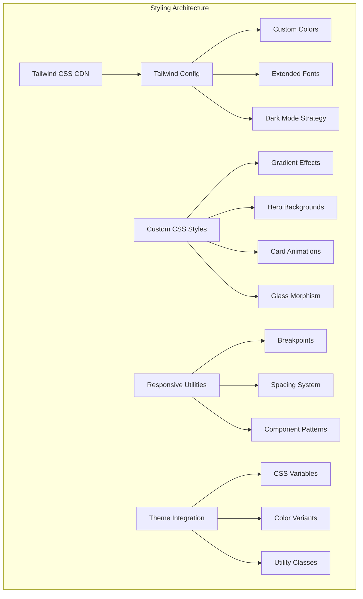
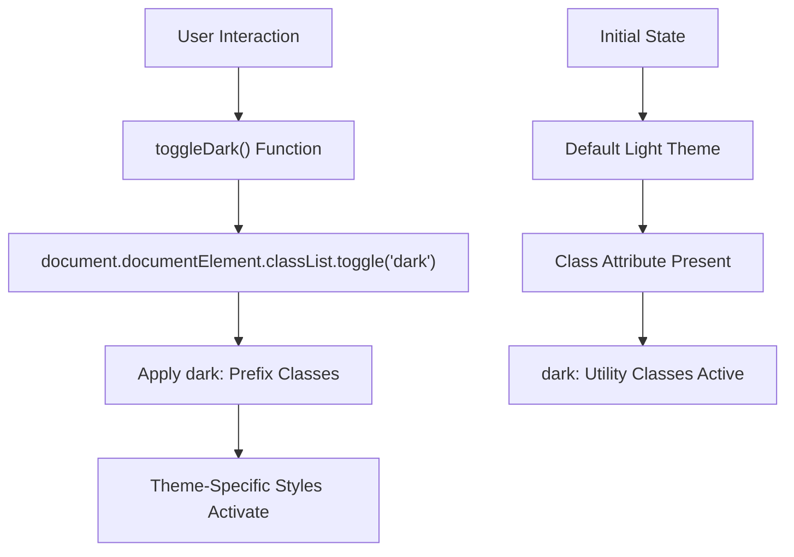
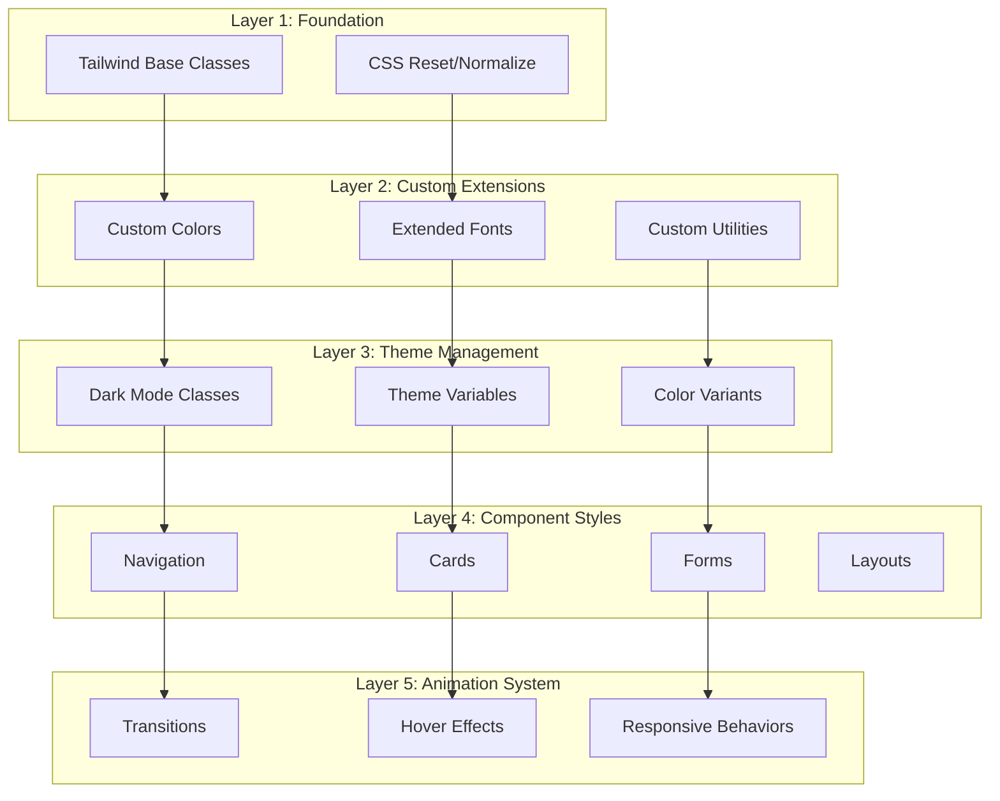
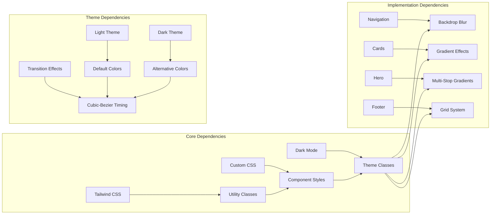

# Styling Architecture & Design System

<cite>
**Referenced Files in This Document**
- [design-preview.html](file://design-preview.html)
</cite>

## Table of Contents
1. [Introduction](#introduction)
2. [Project Structure](#project-structure)
3. [Core Components](#core-components)
4. [Architecture Overview](#architecture-overview)
5. [Detailed Component Analysis](#detailed-component-analysis)
6. [Dependency Analysis](#dependency-analysis)
7. [Performance Considerations](#performance-considerations)
8. [Troubleshooting Guide](#troubleshooting-guide)
9. [Conclusion](#conclusion)

## Introduction

This document provides comprehensive analysis of the styling architecture and design system implementation for a modern web application. The project demonstrates a sophisticated approach to CSS styling using Tailwind CSS with advanced customization, dark mode implementation, and responsive design patterns. The implementation showcases a cohesive design system that supports both light and dark themes seamlessly while maintaining visual consistency across all components.

The styling architecture combines utility-first CSS with custom design tokens, creating a scalable foundation for consistent visual design across the entire application ecosystem.

## Project Structure

The styling architecture is implemented within a single HTML file that serves as both the application shell and the styling demonstration. This structure allows for complete isolation of styling concerns while showcasing the integrated nature of the design system.

**Diagram sources**
- [design-preview.html:7-30](file://design-preview.html#L7-L30)
- [design-preview.html:31-57](file://design-preview.html#L31-L57)

**Section sources**
- [design-preview.html:1-456](file://design-preview.html#L1-L456)

## Core Components

### Tailwind CSS Configuration

The styling system begins with a comprehensive Tailwind CSS configuration that establishes the foundation for the entire design system. The configuration implements a class-based dark mode strategy, extending the default theme with custom design tokens.

#### Dark Mode Implementation

The dark mode system utilizes the class strategy, enabling seamless theme switching through DOM manipulation. This approach provides better control over theme transitions and avoids potential conflicts with browser-level preferences.

**Diagram sources**
- [design-preview.html:450-454](file://design-preview.html#L450-L454)

#### Custom Color Palette

The design system introduces a custom primary blue color scheme that serves as the primary brand color across all components. The color palette extends beyond the default Tailwind colors, providing semantic meaning and consistent usage patterns.

| Color Shade | Usage | Light Theme | Dark Theme |
|-------------|-------|-------------|------------|
| 50 | Lightest | `#eff6ff` | `#0f172a` |
| 100 | Very Light | `#dbeafe` | `#1e293b` |
| 500 | Primary | `#3b82f6` | `#6ba6ff` |
| 600 | Primary Dark | `#2563eb` | `#3b82f6` |
| 700 | Secondary Dark | `#1d4ed8` | `#2563eb` |
| 900 | Darkest | `#1e3a8a` | `#1e3a8a` |

#### Extended Font Family Configuration

The typography system integrates both Western and Chinese font stacks, ensuring optimal readability across different languages and regions. The font configuration prioritizes system fonts for performance while providing fallbacks for internationalization.

**Section sources**
- [design-preview.html:10-29](file://design-preview.html#L10-L29)

### Custom CSS Additions

Beyond Tailwind's utility classes, the implementation includes carefully crafted custom CSS that enhances the visual experience and creates distinctive design elements.

#### Gradient Text Effects

The gradient text effect creates visually appealing headings and branding elements through advanced CSS background clipping techniques. This effect transforms standard text into dynamic gradient displays that adapt to the surrounding design context.

#### Hero Gradient Backgrounds

The hero section employs sophisticated multi-stop gradient backgrounds that create depth and visual interest. These gradients incorporate multiple color stops to produce smooth transitions that enhance the overall aesthetic appeal.

#### Card Hover Animations

The card hover animation system implements smooth transitions with precise timing curves using cubic-bezier functions. These animations provide subtle feedback during user interactions while maintaining performance standards.

#### Glass Morphism Effects

The glass morphism effect creates translucent, frosted-glass appearances through advanced backdrop filtering techniques. This effect requires careful consideration of both light and dark theme implementations to ensure readability and accessibility.

**Section sources**
- [design-preview.html:31-57](file://design-preview.html#L31-L57)

## Architecture Overview

The styling architecture follows a layered approach that separates concerns between utility classes, custom CSS, and theme management systems.

**Diagram sources**
- [design-preview.html:7-30](file://design-preview.html#L7-L30)
- [design-preview.html:31-57](file://design-preview.html#L31-L57)

## Detailed Component Analysis

### Navigation System

The navigation component demonstrates sophisticated dark mode integration with backdrop blur effects and theme-aware color variants. The implementation showcases how utility classes can be combined to create complex visual effects while maintaining semantic clarity.

#### Responsive Navigation Pattern

The navigation system adapts seamlessly across different screen sizes using Tailwind's responsive utility classes. The mobile-first approach ensures optimal user experience across all device categories.

#### Dark Mode Navigation Elements

The navigation components implement theme-aware styling that automatically adjusts colors, borders, and transparency effects based on the current theme state. This ensures consistent visual hierarchy regardless of theme selection.

**Section sources**
- [design-preview.html:61-91](file://design-preview.html#L61-L91)

### Hero Section Implementation

The hero section exemplifies the integration of custom CSS with Tailwind utilities to create visually stunning landing experiences. The implementation combines gradient backgrounds, backdrop blur effects, and sophisticated layout patterns.

#### Multi-Layered Background System

The hero background employs multiple layered elements including gradient overlays, blurred circles, and positioning effects that create depth and visual interest. This approach demonstrates advanced CSS composition techniques.

#### Content Hierarchy and Typography

The hero section implements clear typographic hierarchy with gradient text effects for primary headings and complementary text treatments for supporting content. The layout maintains readability across different screen sizes.

**Section sources**
- [design-preview.html:94-122](file://design-preview.html#L94-L122)

### Category Cards System

The category cards demonstrate the card hover animation system with precise timing controls and visual feedback mechanisms. Each card incorporates gradient backgrounds, hover effects, and responsive sizing.

#### Interactive Card States

The card system implements multiple interactive states including default, hover, and active states. The hover effects utilize cubic-bezier timing functions to create smooth, natural transitions that enhance user experience.

#### Gradient Integration Pattern

Each category card applies themed gradient backgrounds that align with the brand's color scheme while maintaining visual distinction between different categories. This pattern ensures consistent brand identity across all card variations.

**Section sources**
- [design-preview.html:131-170](file://design-preview.html#L131-L170)

### Article Card System

The article card system represents the most complex component in the design system, incorporating multiple visual elements including image placeholders, metadata displays, author information, and interactive elements.

#### Image Placeholder System

The article cards utilize gradient-based image placeholders that maintain aspect ratios while providing visual consistency. These placeholders adapt to different content types and screen sizes.

#### Metadata and Author Information

The cards implement sophisticated metadata displays including category badges, publication dates, author avatars, and engagement metrics. Each element contributes to the overall information hierarchy while maintaining visual balance.

#### Hover State Complexity

The article card hover states incorporate multiple simultaneous animations including elevation, shadow changes, and color transitions. These effects require careful coordination to maintain performance and visual coherence.

**Section sources**
- [design-preview.html:184-324](file://design-preview.html#L184-L324)

### Newsletter and Form Components

The newsletter section demonstrates form component styling with theme-aware inputs, buttons, and validation states. The implementation ensures consistent styling across different form elements while maintaining accessibility standards.

#### Form Input Styling

The email input field incorporates theme-aware borders, backgrounds, and focus states that adapt to the current theme. The styling maintains optimal contrast ratios and provides clear visual feedback during user interactions.

#### Button Component Variations

The newsletter section includes multiple button styles demonstrating the versatility of the design system. Buttons incorporate hover effects, color transitions, and responsive sizing that work consistently across different themes.

**Section sources**
- [design-preview.html:385-398](file://design-preview.html#L385-L398)

### Footer Component

The footer component showcases the complete design system's integration across different sections of the application. It demonstrates typography hierarchy, link styling, and social media integration with consistent theming.

#### Grid Layout System

The footer employs Tailwind's grid system to create responsive layouts that adapt to different screen sizes. The grid ensures optimal content distribution while maintaining visual balance.

#### Social Media Integration

The footer includes social media links with consistent styling that adapts to both light and dark themes. The implementation demonstrates how theme-aware styling can be applied to interactive elements.

**Section sources**
- [design-preview.html:400-448](file://design-preview.html#L400-L448)

## Dependency Analysis

The styling architecture exhibits excellent modularity with clear separation of concerns between different styling layers and components.

**Diagram sources**
- [design-preview.html:7-30](file://design-preview.html#L7-L30)
- [design-preview.html:31-57](file://design-preview.html#L31-L57)

### Coupling and Cohesion Analysis

The design system demonstrates strong internal cohesion with well-defined boundaries between different styling concerns. The modular approach enables easy maintenance and extension of individual components without affecting the broader system.

### External Dependencies

The implementation relies primarily on Tailwind CSS CDN for base styling utilities, with minimal external dependencies. This approach ensures fast loading times and reduces maintenance overhead while providing comprehensive styling capabilities.

**Section sources**
- [design-preview.html:7-8](file://design-preview.html#L7-L8)

## Performance Considerations

The styling architecture incorporates several performance optimization strategies that ensure efficient rendering and smooth user interactions.

### CSS Optimization Strategies

The implementation minimizes CSS bloat through strategic use of utility classes and selective custom CSS additions. The approach balances flexibility with performance by leveraging Tailwind's purging capabilities and avoiding unnecessary style declarations.

### Animation Performance

The animation system utilizes hardware-accelerated properties including transform and opacity changes that minimize layout thrashing and repaint costs. The cubic-bezier timing functions are carefully selected to balance visual appeal with performance characteristics.

### Theme Switching Performance

The class-based dark mode implementation provides instant theme switching without requiring CSS reloads or complex reflows. This approach ensures smooth transitions between themes while maintaining optimal performance.

## Troubleshooting Guide

### Common Styling Issues

#### Dark Mode Not Activating

Ensure that the `toggleDark()` function is properly bound to user interactions and that the `dark` class is correctly toggled on the document element. Verify that theme-aware utility classes are properly configured in the Tailwind configuration.

#### Gradient Effects Not Displaying

Check that gradient text effects are properly applied to text elements and that the `-webkit-background-clip: text` property is supported by the target browser. Verify that the text color is set appropriately for the gradient effect.

#### Glass Morphism Issues

Confirm that backdrop blur effects are supported by the target browser and that the `backdrop-filter` property is properly applied. Test the effect across different browsers to ensure consistent behavior.

#### Responsive Layout Problems

Verify that responsive utility classes are properly ordered and that mobile-first breakpoints are correctly configured. Test layouts across different screen sizes to ensure optimal responsiveness.

**Section sources**
- [design-preview.html:450-454](file://design-preview.html#L450-L454)

## Conclusion

The styling architecture and design system implementation demonstrates a comprehensive approach to modern CSS development that balances flexibility, performance, and maintainability. The integration of Tailwind CSS with custom design tokens creates a robust foundation for consistent visual design across diverse application contexts.

The implementation successfully addresses key challenges in contemporary web development including theme management, responsive design, and performance optimization. The class-based dark mode strategy provides superior control over theme transitions while maintaining compatibility across different environments.

The design system's modular architecture ensures scalability and maintainability, allowing for easy extension and modification as requirements evolve. The combination of utility-first CSS with thoughtful customizations creates a powerful foundation for building sophisticated user interfaces that adapt seamlessly to different user preferences and contexts.

This architecture serves as an exemplary model for modern web applications seeking to implement comprehensive design systems that support both light and dark themes while maintaining optimal performance and user experience standards.