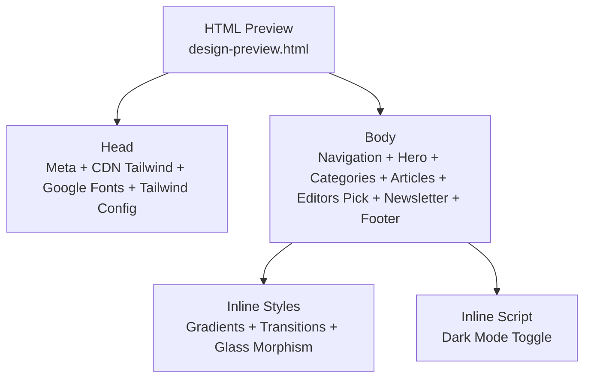
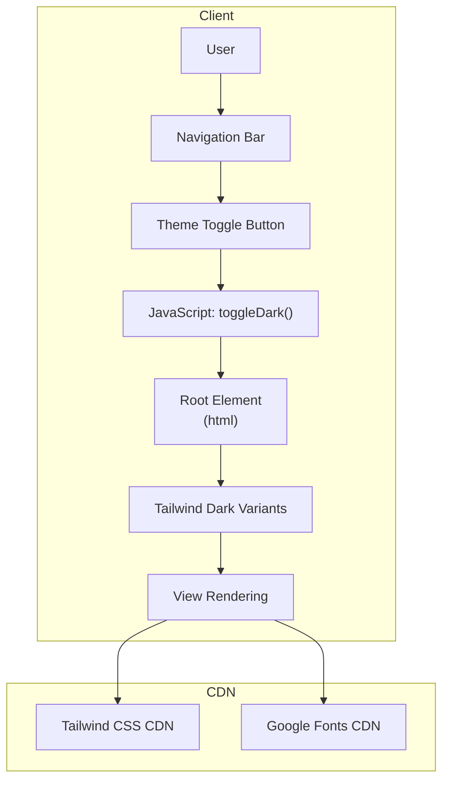
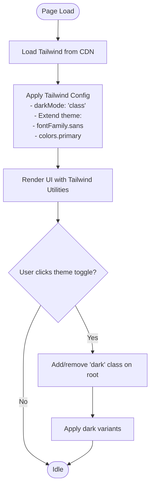
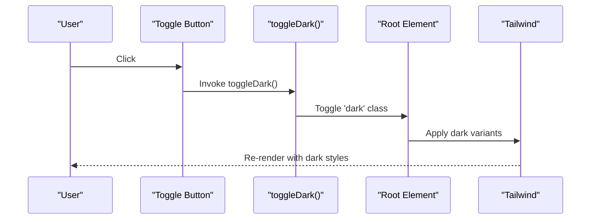
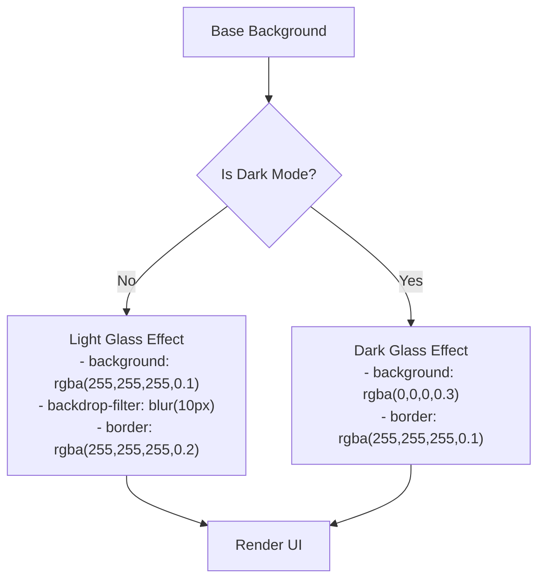
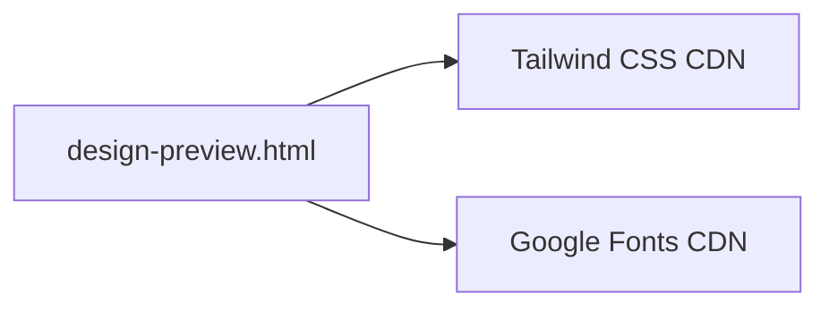

# Technology Stack & Dependencies

<cite>
**Referenced Files in This Document**
- [design-preview.html](file://design-preview.html)
</cite>

## Table of Contents
1. [Introduction](#introduction)
2. [Project Structure](#project-structure)
3. [Core Components](#core-components)
4. [Architecture Overview](#architecture-overview)
5. [Detailed Component Analysis](#detailed-component-analysis)
6. [Dependency Analysis](#dependency-analysis)
7. [Performance Considerations](#performance-considerations)
8. [Troubleshooting Guide](#troubleshooting-guide)
9. [Conclusion](#conclusion)

## Introduction
This document explains the technology stack and dependencies used in the TechReview Blog application preview. It focuses on the HTML5 semantic structure and modern web standards, the Tailwind CSS utility-first framework integrated via CDN with a custom configuration for dark mode, a primary color palette, and font family setup, the Google Fonts integration for Inter and Noto Sans SC, and the inline SVG icon system. It also documents the minimal JavaScript implementation for dark mode toggle, CSS custom properties and theme switching, advanced styling techniques such as gradients and glass morphism, responsive design patterns, and CDN dependency management with performance considerations.

## Project Structure
The project is a single-file static HTML preview that demonstrates the complete front-end stack. It includes:
- A head section with meta tags, CDN-loaded Tailwind CSS, Google Fonts stylesheet, and a small inline script configuring Tailwind’s dark mode and theme extensions.
- An extensive body implementing a modern blog layout with navigation, hero, categories, article cards, editor’s pick, newsletter, and footer.
- Inline styles for advanced effects (gradients, transitions, glass morphism).
- Minimal inline JavaScript for toggling dark mode.

**Diagram sources**
- [design-preview.html](file://design-preview.html)

**Section sources**
- [design-preview.html](file://design-preview.html)

## Core Components
- HTML5 semantic structure: The page uses semantic sections and articles to organize content, aiding accessibility and SEO.
- Tailwind CSS CDN: Loaded from a public CDN to enable utility-first styling without local build steps.
- Tailwind configuration: Dark mode is enabled via class strategy, and the theme is extended with a custom primary color palette and a custom font family combining Inter and Noto Sans SC.
- Google Fonts: Inter and Noto Sans SC are loaded to support both Latin and Chinese characters with multiple weights.
- Inline SVG icons: Scalable vector graphics are embedded directly for crisp rendering at any size.
- Dark mode toggle: A small JavaScript function toggles a class on the root element to switch themes.
- Advanced styling: Gradients, transitions, and glass morphism effects are implemented with Tailwind utilities and custom CSS.
- Responsive design: Grids, spacing utilities, and breakpoints (sm, md, lg) ensure layouts adapt across screen sizes.

**Section sources**
- [design-preview.html](file://design-preview.html)

## Architecture Overview
The application follows a client-side rendering model with CDN-hosted libraries and inline assets. The runtime flow for theme switching is straightforward: clicking the dark mode button triggers a DOM class toggle that Tailwind interprets to apply dark variants.

**Diagram sources**
- [design-preview.html](file://design-preview.html)

## Detailed Component Analysis

### Tailwind CSS Integration and Configuration
- CDN loading: Tailwind is included via a CDN script tag in the head.
- Dark mode strategy: Enabled using the class strategy so that adding a class to the root element switches the theme.
- Theme extensions:
  - Font family: A custom sans font stack combining Inter and Noto Sans SC.
  - Primary color palette: A custom blue-based palette mapped under the primary namespace for consistent branding.

**Diagram sources**
- [design-preview.html](file://design-preview.html)

**Section sources**
- [design-preview.html](file://design-preview.html)

### Typography and Fonts
- Google Fonts integration: Inter and Noto Sans SC are loaded with multiple weights to support varied typographic needs.
- Font stack: The configured sans font prioritizes Inter, falls back to Noto Sans SC for CJK glyphs, and ends with a generic sans-serif fallback.
- Usage: The chosen font stack is applied across the interface for readable, modern typography.

**Section sources**
- [design-preview.html](file://design-preview.html)

### Inline SVG Icon System
- Scalable graphics: Icons are embedded as inline SVGs to ensure crisp rendering at any size and to avoid extra network requests.
- Accessibility: Many icons are used as decorative elements; for functional icons, consider adding aria-labels or roles for assistive technologies.
- Consistent styling: Icons inherit text color and sizing via utility classes, maintaining visual consistency.

**Section sources**
- [design-preview.html](file://design-preview.html)

### Dark Mode Toggle and Theme Switching
- Minimal JavaScript: A single function toggles a class on the root element to switch between light and dark themes.
- Conditional rendering: Two SVG icons are shown depending on the current theme, enabling immediate visual feedback.
- Tailwind dark variants: Dark-mode-specific styles are applied automatically when the class is present.

**Diagram sources**
- [design-preview.html](file://design-preview.html)

**Section sources**
- [design-preview.html](file://design-preview.html)

### Advanced Styling Techniques
- Gradients: Gradient text and hero backgrounds use CSS linear gradients for vibrant visuals.
- Transitions and transforms: Hover effects include subtle transforms and shadows for depth and interactivity.
- Glass morphism: A semi-transparent, blurred effect with a thin border simulates a frosted-glass appearance, with a dark-mode variant for contrast.

**Diagram sources**
- [design-preview.html](file://design-preview.html)

**Section sources**
- [design-preview.html](file://design-preview.html)

### Responsive Design Patterns
- Breakpoints: The layout uses responsive utilities (sm, md, lg) to adjust spacing, grid columns, and typography at different viewport widths.
- Grid systems: Sections employ grid layouts that condense or expand based on screen size.
- Spacing and padding: Consistent padding and margin utilities ensure readable layouts across devices.

**Section sources**
- [design-preview.html](file://design-preview.html)

## Dependency Analysis
The application relies on two external CDNs:
- Tailwind CSS CDN: Provides utility classes and dark mode variants.
- Google Fonts CDN: Supplies Inter and Noto Sans SC fonts.

**Diagram sources**
- [design-preview.html](file://design-preview.html)

**Section sources**
- [design-preview.html](file://design-preview.html)

## Performance Considerations
- CDN usage: Leveraging CDNs reduces server load and benefits from global caching and compression.
- Inline SVGs: Eliminate extra HTTP requests for icons and scale crisply.
- Minimal JavaScript: The dark mode toggle is lightweight and does not require a framework.
- Font loading: Preloading Google Fonts improves typography performance; consider preconnecting the fonts domain if needed.
- CSS delivery: Keep styles scoped to the page to avoid unnecessary cascade complexity; the inline approach works for a single-page preview but consider extracting styles for larger applications.

[No sources needed since this section provides general guidance]

## Troubleshooting Guide
- Dark mode not switching:
  - Verify the toggle function is bound to the button click event.
  - Ensure the root element receives the dark class and Tailwind’s dark mode is configured to class strategy.
- Fonts not loading:
  - Confirm the Google Fonts stylesheet link is reachable and not blocked by network policies.
  - Check browser console for CORS or mixed-content errors.
- SVGs not visible:
  - Ensure inline SVGs are properly closed and sized appropriately.
  - Verify stroke and fill attributes align with theme colors.

**Section sources**
- [design-preview.html](file://design-preview.html)

## Conclusion
The TechReview Blog preview demonstrates a modern, accessible, and performant front-end stack built with CDN-hosted libraries and minimal customizations. Tailwind’s utility classes, combined with a custom dark mode configuration, a carefully selected font stack, and inline SVGs, deliver a polished user experience. Advanced effects like gradients and glass morphism enhance visual appeal while maintaining responsiveness across devices.